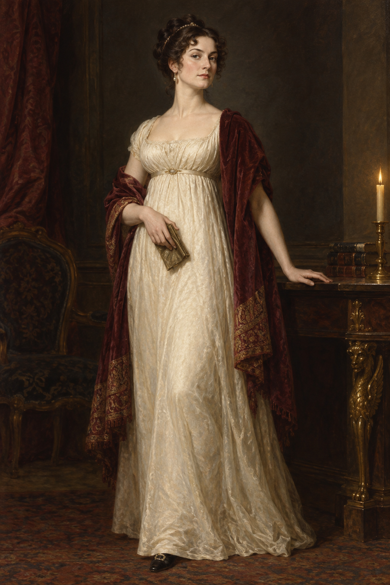

# 坡夫人 (Lady Pole)

## 已確認的特徵（截至第十五章）

- **身分**：沃特・坡爵士的妻子；在第七章的病室事件後重新活著回到社會。
- **身體狀態**：復生後比先前更有活力，走路很快，也能跳舞；倫敦社交圈把這種活力迅速轉成公共形象。
- **思考與行動**：開始形成自己的政治判斷，能在晚宴上直接追問諾瑞爾為何找不到一位真正的幫手。
- **視覺鎖定**：本設定稿只鎖定她復生後的健康、敏捷與不受拘束的姿態；臉部、髮型、精確年齡與服裝細節仍以第十五章未確認為開放問題。

## 劇透邊界

不補入後續章節對她的婚姻、魔法代價或身體狀態的解釋；畫面不得把她描繪成鬼魂、殭屍或已知的超自然施術者。

