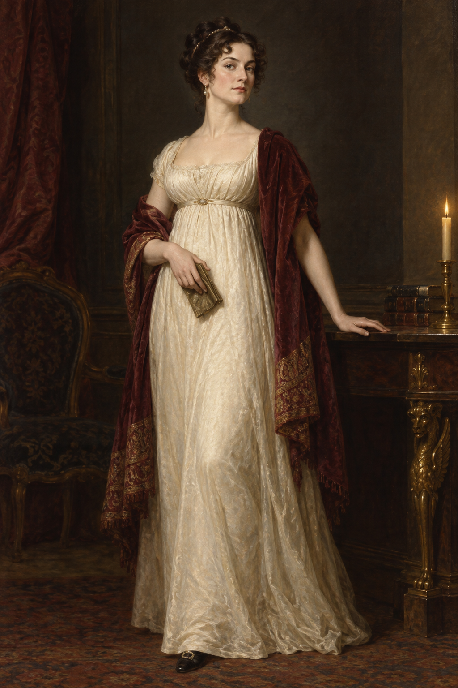

# 坡夫人 (Lady Pole)

## 已確認的特徵（截至第二十七章）

- **身分**：沃特・坡爵士的妻子；在第七章的病室事件後重新活著回到社會。
- **身體狀態**：復生後比先前更有活力，走路很快，也能跳舞；倫敦社交圈把這種活力迅速轉成公共形象。
- **思考與行動**：能在晚宴上直接追問諾瑞爾為何找不到真正的幫手；第二十七章也明確說她長期想向人講出自己的遭遇，卻無法按本意說完。
- **第二十七章外貌**：皮膚蒼白細膩，深棕色頭髮梳理得優雅整齊；精確年齡仍未明。
- **第二十七章服裝**：出場時穿細白紗裙衣，披象牙白底、銀黑鑲邊的印度披肩。這是該次會面的衣著記錄，不推定為常服。

## 劇透邊界

不補入第二十七章之後對她的婚姻、魔法代價或身體狀態的解釋；畫面不得把她描繪成鬼魂、殭屍或已知的超自然施術者。
