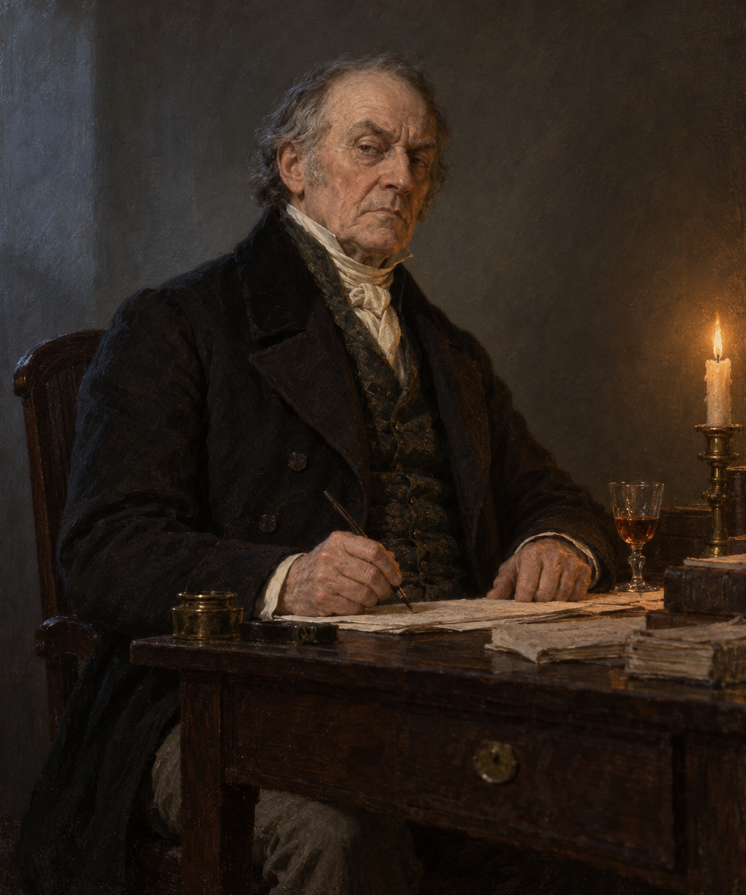

# 勞倫斯・斯特蘭奇 (Lawrence Strange)

## 已確認外貌與行為

- **身分與年齡感**：什羅普郡的地主與斯特蘭奇家家主；第 014 章已是年老的男人，確切年齡與面容未鎖定。
- **人生軌跡**：年輕時繼承破屋、貧瘠土地與債務，靠婚姻取得資金後修繕地產、放貸與擴張財富。
- **性格**：傲慢、貪財、缺乏同情；厭棄妻子與兒子，把農民的困境與親人的需要當成妨礙自己獲利的成本。
- **行為**：夜間坐在書桌前寫信辦公，要求僕人持續伺候；第 014 章中打開窗戶讓雪進入書房，迫使發燒的 Jeremy 留下工作。
- **敘事位置**：他沒有施法，卻把土地、法律、債務與僕役制度變成傷人的工具；最後在同一間被他打開的冰冷書房裡凍死。

## 劇透邊界

設定只鎖定第 014 章已讀內容：地主、老年、書房、雪夜命令與凍死；不補入後續家族史、人物關係或 Jonathan Strange 的未讀發展。
