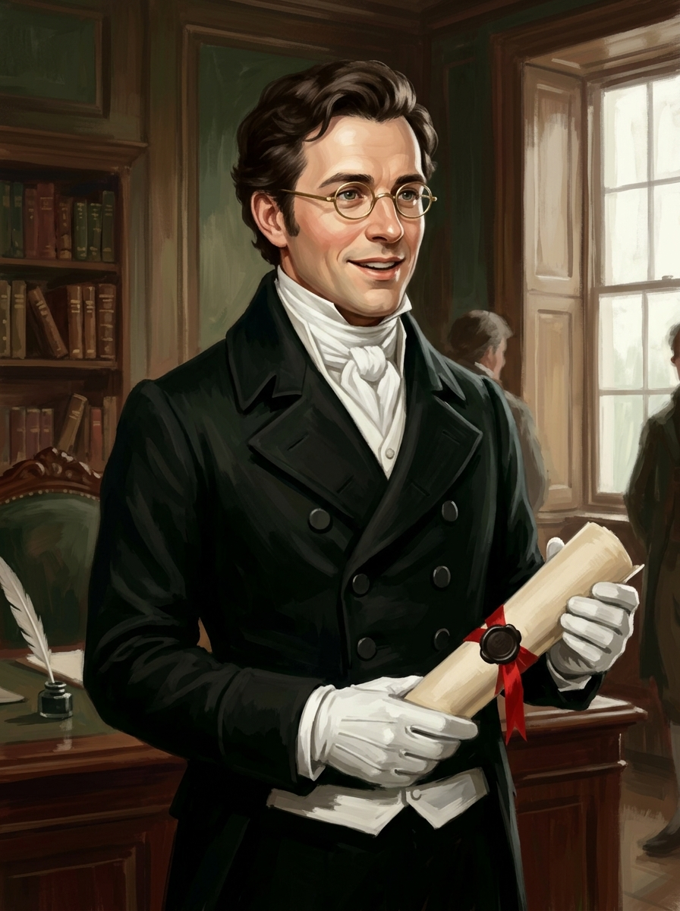

# 羅賓森律師 (Lawyer Robinson)

## 外貌與特徵
- **年齡與體態**：四十餘歲，體態勻稱幹練，相貌端正討喜，隨時帶著如沐春風的職業微笑。
- **打扮**：架著金絲眼鏡，身穿一絲不苟的黑呢大衣、乾淨白領巾與純白羊皮手套，手持用紅絲帶封緘的羊皮紙契約。
- **身分**：約克康尼大街的事務所律師，諾瑞爾先生的法律代理人。

## 敘事意義
以世俗法律契約形式推動古魔法秩序重構的使者。他對魔法一無所知，卻用純熟的法律工具與謙遜客氣的言辭，將約克魔法協會全體成員逼入「全體簽字解散」的絕境。
