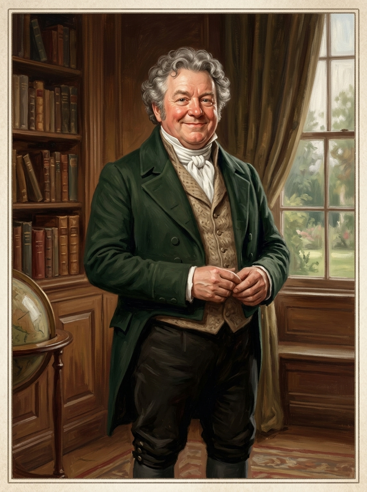

# 亨尼福特先生 (Mr. Honeyfoot)

## 外貌與特徵
- **年齡與體態**：五十五歲，身材高大微胖，滿面紅光，面相十分可人和藹。
- **面容與打扮**：灰白鬈髮，眼神充滿善意與熱情，常穿著體面的深綠色呢外套與米色背心，隨時掛著誠懇的笑容。
- **性格特徵**：精力充沛、樂觀熱誠，凡事皆往好處想；被小石像講述的五百年前冤案深深打動，不厭其煩地給教長與主教寫信，最終在南門廊掘出裝有常春藤女孩骸骨的鉛棺。

## 敘事意義
代表了紳士階層中最純粹的善良與熱忱。他雖然在諾瑞爾的協議上簽了字而被剝奪魔法師身分，卻從不怨天尤人，反而將全部熱情投入為石像昭雪冤案的漫長努力中。
