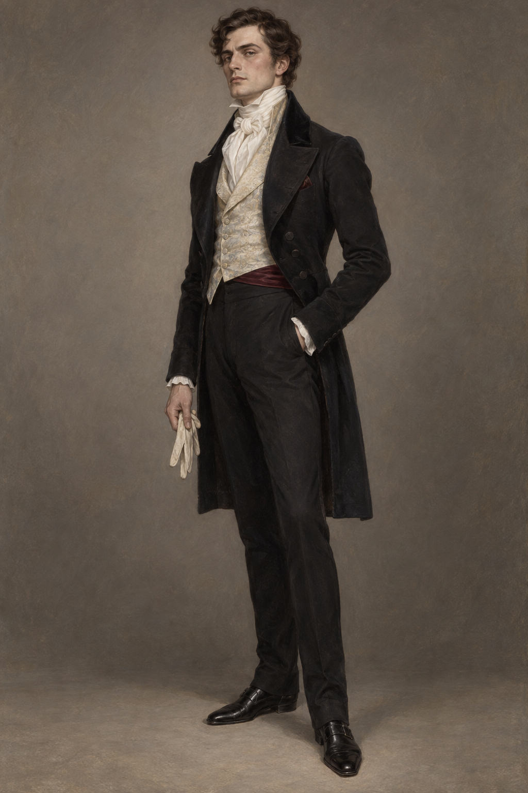

# 拉塞爾斯先生 (Mr. Lascelles)

## 已確認的外貌與行為

- **體態**：高大、英俊。
- **氣質**：冷淡、高傲；在擁擠的晚宴中仍維持距離感。
- **敘事行為**：以尖刻的玩笑拆穿德羅萊特對諾瑞爾的誇張宣傳，對他人的財富與困境都缺乏憐憫。

## 視覺約束

- 使用十九世紀初倫敦晚宴的正式男士服裝與端正姿態；服裝顏色、確切年齡、髮色與配件目前未由已讀章節確認，僅作畫面詮釋，不升格為後續事實。
- 保留「高大英俊、冷酷傲慢」的輪廓，不把他畫成魔法師或施法者。

## 開放資訊

小說目前沒有確認他的確切年齡、家族背景、日常服裝細節或與德羅萊特以外人物的關係。
