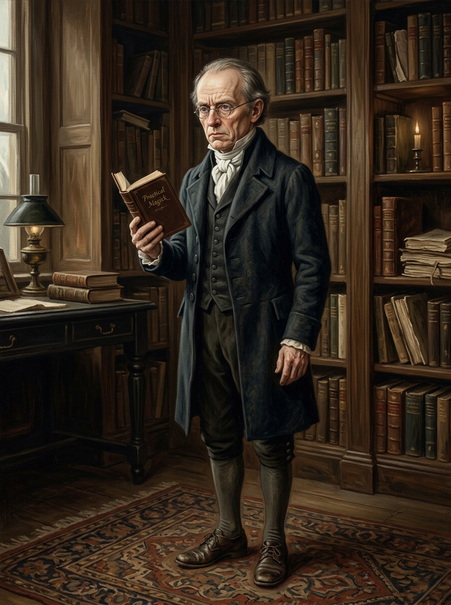

# 吉爾伯特・諾瑞爾 (Mr. Gilbert Norrell)

## 外貌與特徵
- **年齡與體態**：約五十餘歲至六十歲，身材矮小、略微駝背，舉止嚴肅冷靜。
- **面容**：面色蒼白、神情禁慾克制，雙眼小而深邃、呈淺藍色，薄唇緊抿，說話聲音細小而平板。
- **服飾**：身著素黑羊毛紳士長燕尾服、深色背心、白色領巾與短馬褲，一絲不苟。
- **行為習慣**：常手持精巧小牛皮典籍；寫字極小（蠅頭小字）；習慣將所有古籍重新裝訂為原色小牛皮壓銀字封面，並親手裁切剔除不合適的書頁。

## 敘事與象徵意義
英格蘭百年來第一位真正具備實踐能力的魔法師。但他並非魔法的解放者，而是嚴格的壟斷者與審查者。他試圖將野性、古老且未知的魔法體系封裝進體面、受控的紳士學術框架中。
