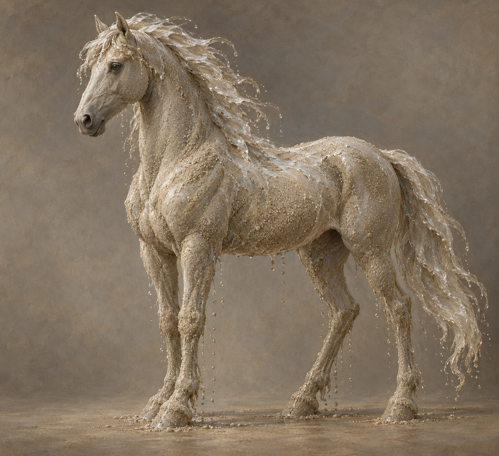

# 銀色沙馬 (Silver Sand Horses)

## 已確認視覺特徵

- 由沙與海水塑成馬形；濕沙的顆粒感留在身體上，鬃毛與四肢帶著流動水痕。
- 形體可辨認為馬，但並非活馬；沒有鞍具、韁繩或生物毛皮。
- 第 028 章中，斯特蘭奇召出大量沙馬協助拖動擱淺的船。設定稿只鎖單匹外形；群體數量與隊形依場景而變。

## 敘事與劇透邊界

只記錄第 028 章已出現的沙水造形與拖船用途。它們維持多久、最後造成什麼影響，只能依後續已讀內容更新，不提前加入設定稿。
