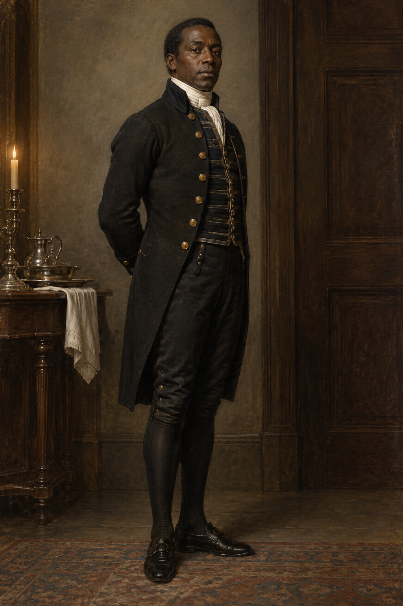

# 史蒂芬・布萊克 (Stephen Black)

## 已確認的特徵（截至第十九章）

- **身分**：坡宅的黑人管家，負責讓鄉下僕人與倫敦僕人之間的宅邸秩序重新運轉。
- **權力位置**：他承擔遠超一般僕人的管理權與判斷權，能壓住僕人間的爭執，也能替不尋常的報告提供立即的常理解釋。
- **外貌鎖定**：確認他是黑人男性，穿著正式管家服，姿態沉著、觀察敏銳且具實務權威；更細的年齡、個人歷史與衣料裝飾不在本章確定範圍內。
- **傳聞邊界**：旁人傳說他是非洲王子；那是周圍人替陌生權威編出的故事，不是本設定對他的身分確認，因此不加入王冠、王室服飾或異國化符號。
- **第十九章狀態**：他疲憊、發冷、少言，並描述自己在宅邸生活時像在夢遊。坡夫人也有相似症狀，但旁人依兩人的階級與工作責任給出不同稱呼。
- **關係判斷**：白髮先生把沃特爵士描述成壓迫者；史蒂芬卻記得爵士曾供他上學，窘迫時也與他同桌取暖，並未接受這種簡化說法。
- **未知景象**：聽到「鎖鏈」一詞時，他看見黑暗、悶熱且有鐵鏈聲的地方；他不認為那是記憶，也不知道它代表什麼。人物設定圖不把此景象具象化。

## 劇透邊界

只納入第十九章以前已確認的外貌、管家職能、疲憊狀態與他親口表達的關係判斷；不補入後續身世、關係或魔法命運。

