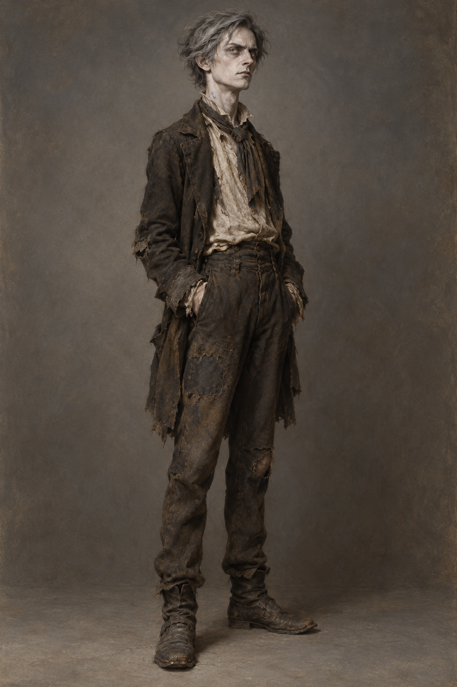

# 聞秋樂 (Vinculus)

## 已確認外貌與行為

- **體態**：瘦骨嶙峋，站姿挺直；年齡未在已讀內容中鎖定。
- **面容與頭髮**：臉色像放了數日的牛奶，頭髮像飄著煤灰的天空；灰色眼珠燃著怒火，神情飛揚跋扈。
- **服飾**：破舊、骯髒的衣裳與隨意圍在脖子上的髒領巾；整體外觀接近街頭傳說中人們想像的巫師，與諾瑞爾的一絲不苟相反。
- **標誌**：領巾下的皮膚有一道鮮藍色彎曲印記；本章沒有確定它是傷疤、體繪或其他事物，場景只保留可見形狀，不替它補充來源。
- **行為**：說話聲量大、情緒直接，將烏衣王相關預言帶入諾瑞爾的書房；能以街頭表演與河神聲音建立群眾注意，但本章沒有證實他具備諾瑞爾所擔心的強大法力。

## 劇透邊界

設定只鎖定第 005 與第 013 章已讀內容：黃色布棚的街頭魔法師、書房闖入、藍色彎印與預言表演；不解釋藍印來源、不具象化烏衣王、不補入第十三章後的人物發展。
