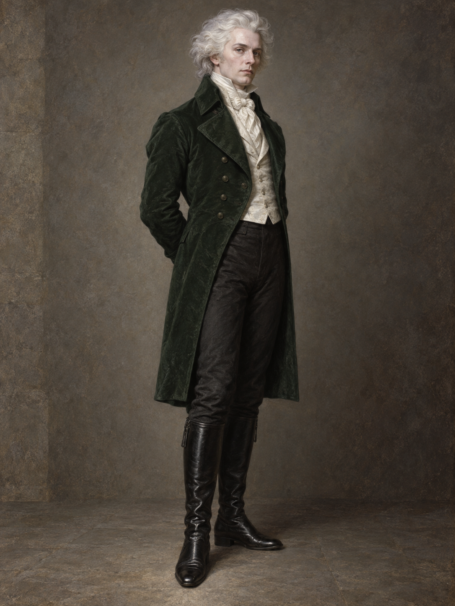

# 白髮舞會主人 (White-Haired Gentleman)

## 已確認的特徵（截至第十六章）

- **外貌**：史蒂芬替他梳理儀容時，看到他濃密、像薊絮般的銀白頭髮；鏡中他的膚色蒼白，近似月光。
- **衣著與舉止**：穿著整潔考究的深綠色外套、白襯衫與精細領巾，對僕役服務有明確期待，並邀請史蒂芬參加舞會。
- **身分邊界**：本章沒有說出他的姓名，也沒有確認他的來歷；他所編述的財產遭奪故事只記作他對史蒂芬的說法，不視為已證實背景。

## 劇透邊界

只呈現第十六章首次出現的外貌與言行；不為他命名、加上超自然身分或補入後續資訊。