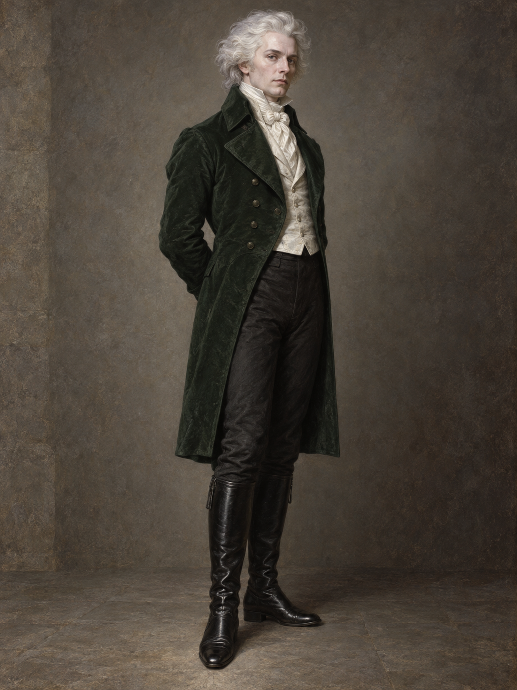

# 白髮舞會主人 (White-Haired Gentleman)

## 已確認的特徵（截至第十九章）

- **外貌**：史蒂芬替他梳理儀容時，看到他濃密、像薊絮般的銀白頭髮；鏡中他的膚色蒼白，近似月光。
- **衣著與舉止**：穿著整潔考究的深綠色外套、白襯衫與精細領巾，對僕役服務有明確期待，並邀請史蒂芬參加舞會。
- **身分邊界**：本章沒有說出他的姓名，也沒有確認他的來歷；他所編述的財產遭奪故事只記作他對史蒂芬的說法，不視為已證實背景。
- **第十九章言行**：他承認自己對史蒂芬施咒，使史蒂芬每晚赴喪冀參加宴席與舞會；也承認金幣是自己安排，並把這些干預稱作幫助。他以史蒂芬的身分、價值與敵人重述其處境，最後提出讓史蒂芬成為國王。
- **意圖邊界**：他的言談把控制說成慷慨，但本章沒有確認他全部的動機或來歷；插圖保留這份矛盾，不畫成已確立的善意或惡意。

## 劇透邊界

只呈現已讀至第三十四章的外貌與言行；不為他命名、補完來歷或確認預言結果。

## 第三十章補充

他聲稱從煙霧等徵兆看出史蒂芬將統治英格蘭，因而不把史蒂芬永久帶去喪冀。他把史蒂芬所述身世改寫成應當報復爵士家族的理由，並承諾尋回史蒂芬的真名。這些是他的判斷與承諾，不等於已確認的命運。本次沿用銀白髮、蒼白膚色與深綠外套設定。

## 第三十四章補充

他自述曾對國王施幻術，並受到斯特蘭奇使用的古法驚嚇；將兩位魔法師視為王位計畫的阻礙，考慮囚禁與其他傷害方式。這些是他的自述與計畫，不把本章尚未發生的囚禁畫成事實。他對城鎮、祖籍和英格蘭人的評斷也不作客觀設定；人物 v1 身分與服裝沿用。
