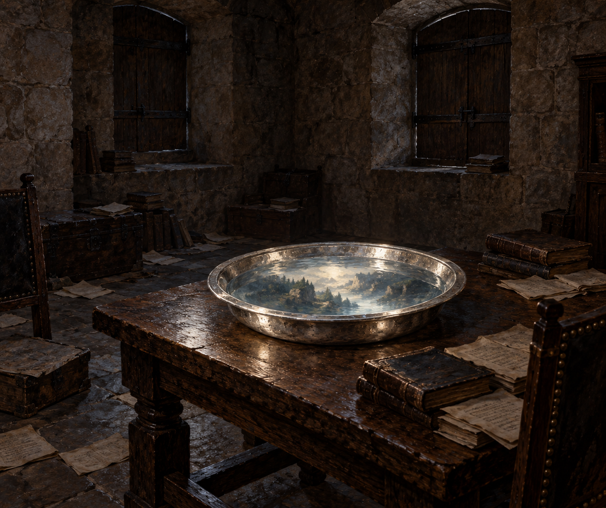

# 阿爾瓦兵器塔的幻影室

第三十一章中，斯特蘭奇在托爾梅斯河畔阿爾瓦城堡僅存的兵器塔內借用無人住的房間。諾瑞爾的四十本書、筆記與零散咒語紙散在各處；中央桌上有盛水的寬沿淺銀盆，窗板緊閉，銀盆是唯一光源。

## 已確認與詮釋

水中可見淡白岩石、橄欖樹和松林，卻沒有足以認出地點的地標。岩石與林木只作模糊輪廓；不畫可辨識逃兵、炮型或精確人數。書數不在畫面逐本點算，但地面與桌旁的書堆必須保留。粗石牆、木桌形狀及書堆位置是室內詮釋，不當成正文事實。

本章銀盆沒有被確認為第12章海軍部的同一只物件；僅沿用 `silver_basin_of_visions` 參考稿的銀色金屬、圓形與水面語法，按本章要求改成寬沿、淺身。設定稿無人物；後續近景可把協助翻譯的懷特上尉留在畫外，不表示他不在場。

## 設定稿 prompt（built-in imagegen）

Work: Jonathan Strange & Mr Norrell, chapter 31, setting id alba_tower_scrying_room. Empty unused room inside the surviving arms tower of Alba de Tormes castle, Spain, July 1812. Three-quarter interior view, rough stone walls, tightly closed wooden shutters, a plain central wooden table carrying a circular broad-rim shallow silver basin full of water. The basin alone illuminates the room with restrained pale reflected light. Worn books and loose unreadable sheets scattered around the floor and table. In the water only indistinct pale rocks and dark olive and pine shapes, no recognizable people. Classical British historical fantasy oil painting, muted stone brown, charcoal and silver. The supplied older basin image is a material and round-form reference only: flatten the vessel to a shallow basin with a broad rim, remove all ships and sea imagery. No people, candles, daylight leaks, readable text, magical runes, gore, modern objects or watermark.

