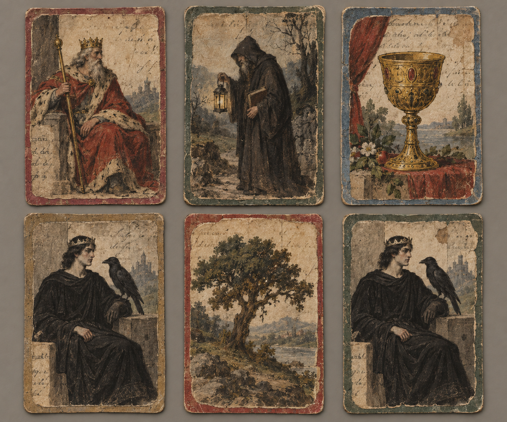

# 齊爾德邁斯的馬賽塔羅 (Childermass's Marseille Tarot)

## 外觀與構造

- 齊爾德邁斯照著一名水手的牌自行繪製；牌面畫在酒館帳條、洗衣清單、信箋、帳本與戲園招貼的背面，再裱到褪色的硬紙板上。
- 紙背印刷字跡會透過部分牌面；墨線粗細與畫工不一，牌組帶有明顯的手作與重用痕跡。
- 第二十一章中，皇帝牌先後呈現普通的老年君王與黑髮年輕君王；後者穿黑袍、戴窄金屬箍，角落的大鳥變成渡鴉。這個變化只記錄該章的場景，不延伸其來源或規則。
- 齊爾德邁斯後續的牌陣中反覆出現聖杯王牌、女教皇與權杖七至十；他把這些圖像讀作隱匿、筆跡與阻隔。

## 敘事意義與未知處

這副牌同時是齊爾德邁斯親手製作的工具，也是聞秋樂看穿他未曾說明之事的媒介。牌面異變的機制、牌是否承載烏衣王，以及兩人的解讀是否可靠，都仍未由第二十一章說明。
