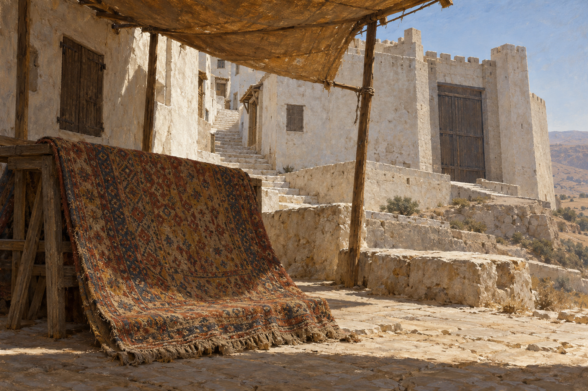

# 白色市集與織毯

## 已確認與詮釋邊界

第34章的市集位在白色山城裡，鄰近高牆與大木門；兩人坐到褐黃舊棚下，叫價師展示地毯。白髮先生談的是囚禁的構想，本章沒有將地毯實際變成囚牢。此卡同時固定市場角落和場景主焦點織毯，避免把普通物件畫成已啟動的法術。

畫稿的鏽紅、赭黃與暗靛幾何織紋、流蘇、支架、石砌細節與牆頂造型是視覺詮釋，並非小說確定的產地或樣式。設定稿的低木支架只供展示，場景圖改由織毯攤在近景地上；不建固定商店攤位。居民、叫價師不在本次設定稿中出場。城鎮所在國家、宗教與史蒂芬祖籍不據白髮先生的說法鎖定。

## 生成規格與視檢

使用內建 imagegen 生成 v1。無人物的歷史奇幻油畫環境設定；保留白牆、窄階、木窗板、大木門、褐黃破棚与普通幾何織毯，光線為熱而乾的日光。無文字、水印、國旗、宗教標誌、可辨識國別、囚犯、飛毯或魔法光效。已開圖視檢，圖稿沒有人物與可見法術。

