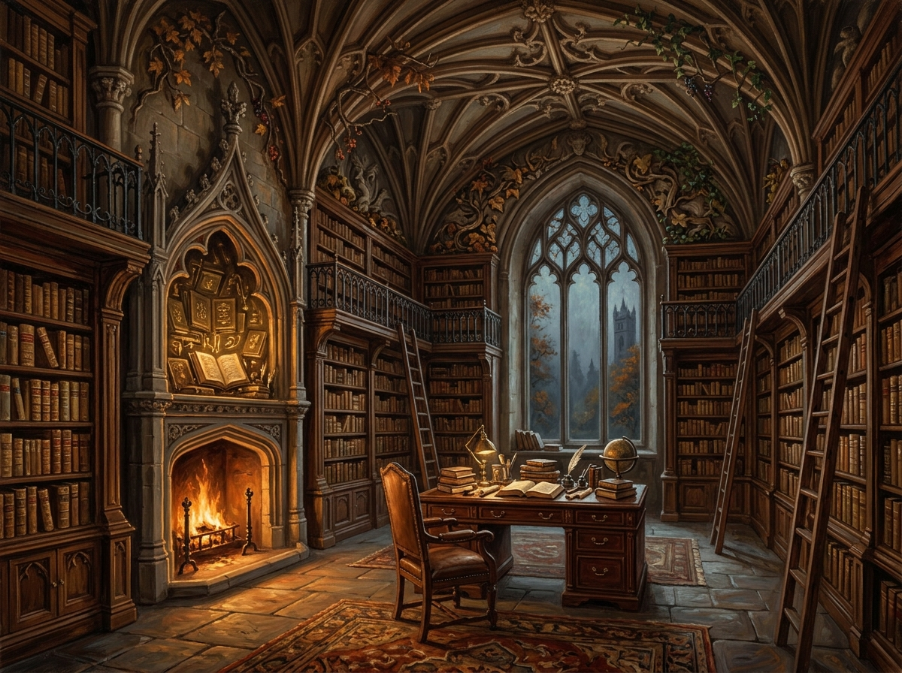

# 何妨寺藏書室 (The Library at Hurtfew Abbey)

## 外貌與構造
- **格局**：位於何妨寺深處，需穿過失去方向感的走廊與石階才能抵達；空間被四面仿哥特拱頂的高大英國原木書架圍繞。
- **雕飾**：書架上雕滿繁複精緻的枯萎秋葉、虯結枝幹、漿果與常春藤，工藝鬼斧神工。
- **典藏**：全英格蘭最宏大完整的魔法古籍庫，幾乎所有書籍皆被重新裝訂為整齊劃一的原色小牛皮封面與壓銀字書脊。
- **光影特徵**：壁爐火焰熊熊，室內存在著無可名狀、無燭自明的奇異微光。

## 敘事意義
諾瑞爾先生統治與壟斷英格蘭魔法實踐的「珠寶匣」與秘密基地，既是無價的知識寶庫，也是被嚴密審查與過濾後的封閉神殿。
