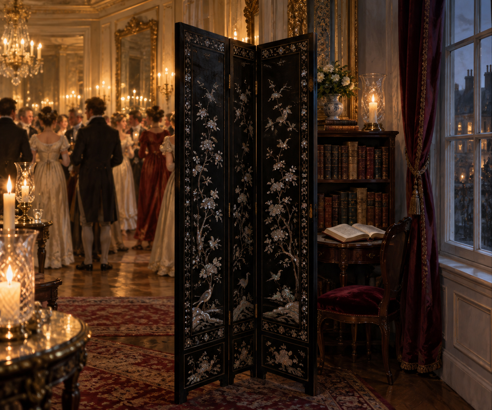

# 曼徹斯特大街晚宴的屏風角落

## 已確認的場景元素

- 曼徹斯特大街一所人潮擁擠、燭光璀璨的倫敦晚宴宅邸。
- 靠窗有一座高大的黑檀木屏風，鑲嵌貝殼；屏風後是一處僻靜角落與書櫃。
- 晚宴室內燠熱、擁擠、喧鬧，鏡子與雕花玻璃燭罐把光線反射得比白天更亮。
- 這個角落讓諾瑞爾暫時退回閱讀，也使他意外聽見別人談論他的傳聞與財產。

## 視覺約束

保留黑檀木、貝殼鑲嵌、靠窗書櫃、金色燭光與人潮壓迫感；不加入後續章節才會確認的魔法現象、人物關係或事件結果。
