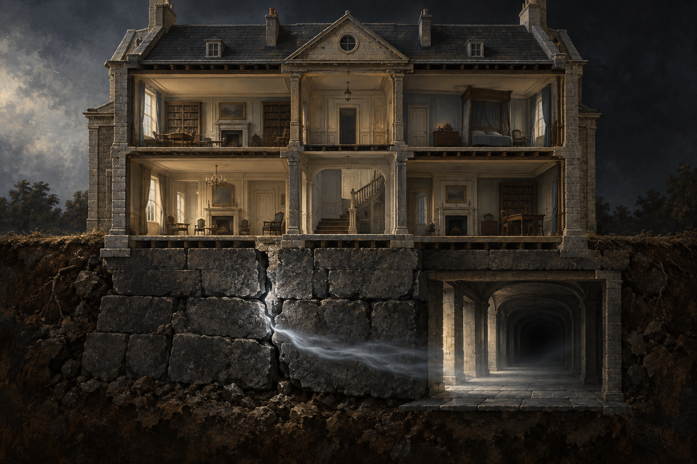

id: magic_foundation_house_metaphor
name: 奇屋的基石與裂隙
type: setting
work: jonathan-strange-mr-norrell
first_appearance: "038"
last_updated: "2026-10-05"
image: ../RawImages/magic_foundation_house_metaphor_v1.png
tags: [setting, metaphor, foundation, knowledge]
---

# 奇屋的基石與裂隙

## 文本依據

第三十八章書評明說，英格蘭魔法像一座由約翰·烏斯克格拉斯打好基礎的奇屋；若忽視基石，裂縫會透進不知來處的風，走廊也可能把人帶往原先沒打算去的地方。

## 視覺界線

這是作者明示比喻的象徵設定，不是可考證的真實房屋。基座石材、屋身與裂隙形狀皆為視覺詮釋；不加入烏斯克格拉斯肖像、龍形標誌或未讀到的歷史事件。走廊盡頭保持未知，不指定它通向何處。