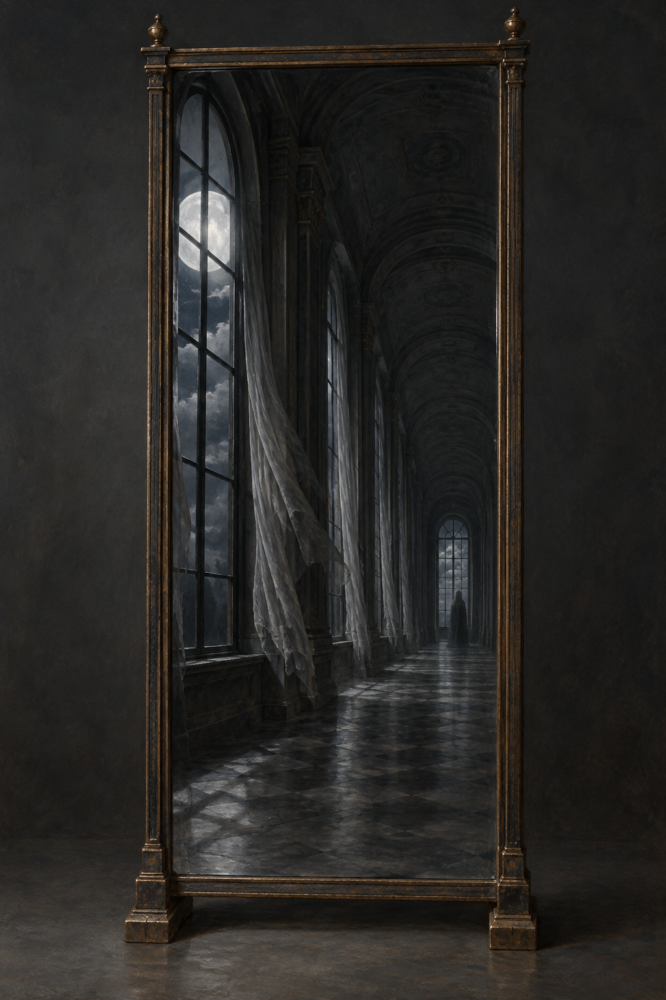

id: mirror_hall_road
name: 鏡中的昏暗長廊
type: setting
work: jonathan-strange-mr-norrell
first_appearance: "036"
last_updated: "2026-10-05"
image: ../RawImages/mirror_hall_road_v1.png
tags: [setting, mirror, road]
---

# 鏡中的昏暗長廊

## 本章可見特徵

- 布爾沃思太太客廳沙發上方的長鏡，映出一扇黑漆高窗、一輪巨大的白月亮與昏暗廳堂。
- 鏡中空間實際更像漫長走廊；窗簾與來人的頭髮、外套被風帶動，鏡外卻感覺不到風。
- 深處的人影在接近鏡面前仍被暗影遮住，身分未明時不指定面孔、服飾細節或來歷。

## 敘事用途與未知處

本設定只依第三十六章初次顯現的鏡像建立。長廊拱頂、石地與鏡框式樣是視覺詮釋，不確定其材質、所在位置是否對應任何已知地點；白月與人影也不補寫成超出本章的世界規則。