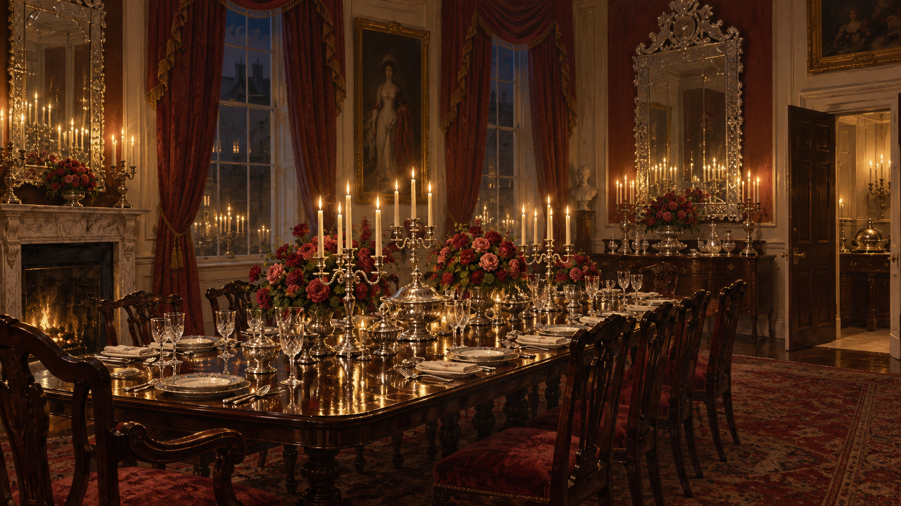

# 九號 Harley Street 的坡宅晚宴

## 已確認的場景元素

- 1808 年 1 月，坡夫人第一次主持的大型晚宴，位於九號 Harley Street。
- 玫瑰、銀器、玻璃與大量燭火共同構成華麗而高反射的餐桌景觀。
- 兩面威尼斯鏡把燭光層層複製，讓社交名聲與宅邸秩序看似比白天更清楚、更可靠。
- 史蒂芬・布萊克的管家工作在這個空間裡維持鄉下僕人、倫敦僕人與賓客之間的界線。

## 視覺約束

保留暗木、紅色布料、玫瑰、銀器、玻璃、燭光與雙重鏡面；三名僕人各自回報的銀髮綠衣人影、悲傷音樂與窗外樹林只能在心得場景圖中以未決的暗示處理，不把它們鎖成已證實的共同魔法。

