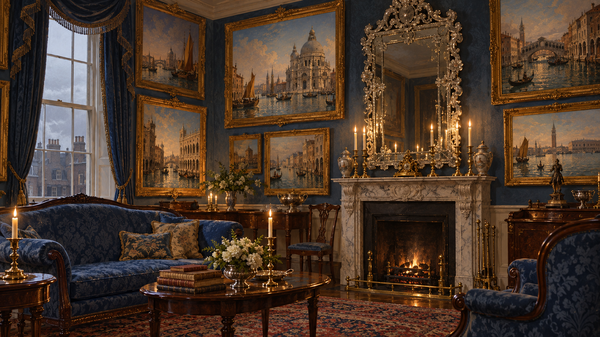

# 坡宅威尼斯畫室

## 已確認的場景元素

- 第二十七章中，九號 Harley Street 有一間雅緻的小會客室，壁爐旁放著一張高背藍色沙發，坡夫人坐在那裡。
- 房裡掛著多幅色彩濃麗的威尼斯油畫；作者描寫室內光線彷彿從畫中而來。壁爐上方有一面大型威尼斯鏡，鏡框裝飾玻璃花朵與繁複渦卷。
- 走廊和鄰室的畫作較為平常，這間小會客室則以海天、宮殿和橋樑的油畫為主。

## 視覺約束

呈現一間尺度有限、擺設雅緻的英國宅邸會客室。油畫造成的光感可以帶出空間方向感的不安，但不把畫中世界畫成已確認的實體入口，不增加可讀文字或本章以後的資訊。
