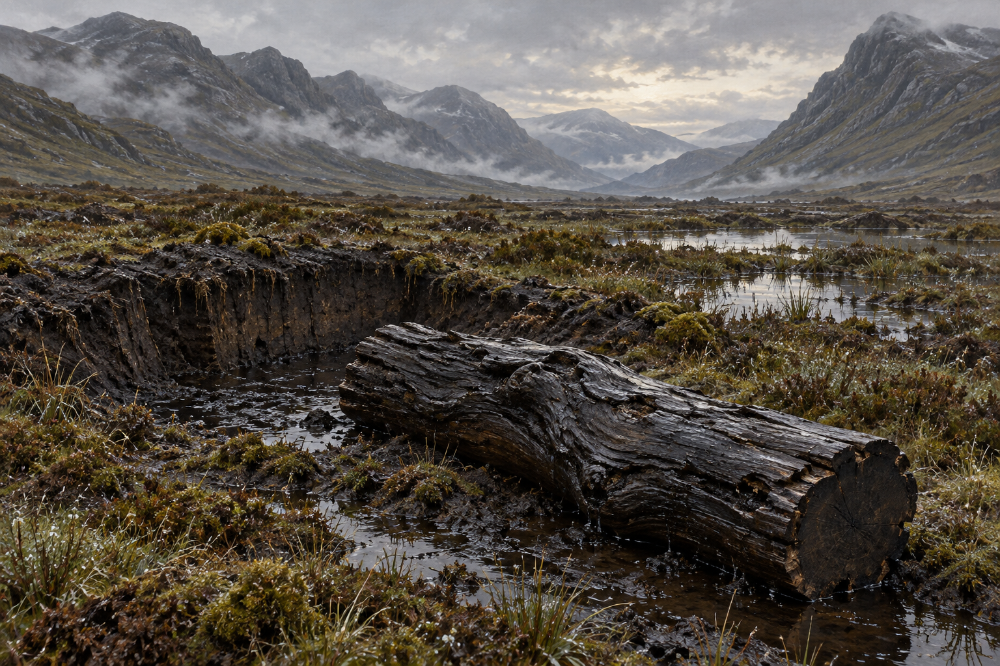

# 🖼️ 蘇格蘭沼澤與腐橡木

第42章中，史蒂芬在夜裡被帶到冰冷、風雨交加的開闊沼澤。黎明看見高大灰郁群山與黑色沼澤；白髮先生說此地是蘇格蘭。青草、苔蘚與微小植物覆滿露珠，一道寬長的無露地皮成為挖掘位置。本卡不指定精確地名、山峰或地理方向。

古木經長年浸泡，與腐土同樣烏黑濕潤。白髮先生要求一段約史蒂芬腰粗、長至自己鎖骨高度的木段；取出後表面細滑、滲著黑水。具體斷面、姿態與局部泥坑形狀是插圖詮釋，不能當作木头將來用途的證據。

設定稿只畫黎明群山、黑色泥地、露水植物及取出的木段，不畫人物。工具在正式場景可依正文採斧頭、長扦與鏟形器具；正文稱材料為流沙與星光化合物，精確製法與形制未確認，畫面只留冷色反光，不加入可讀文字、發光符文、變成人的木頭或未知夫人。

v1已打開視檢：群山、黑色泥坑與單一濕黑木段完整，無人物、文字或水印。初稿纖維紋理偏粗、尺度為環境參考的近景誇張；正式場景另按腰粗與鎖骨高比例縮至人體尺度，要求較細滑濕面。此稿不單獨鎖定木段精確斷面。

## 設定稿 prompt（built-in image_gen）

Use case: illustration-story. Work: Jonathan Strange & Mr Norrell; setting id: scottish_bog_oak; chapter 42 only. Neutral environmental reference plate, no people. Bleak grey dawn in an unnamed Scottish mountain valley, tall grey mountains enclosing a broad black peat bog, wet moss, tiny plants and dew. In foreground a shallow excavated peat hollow and one extracted upright-length irregular bog-oak segment, approximately adult waist thick and collarbone-height long, very dark smooth wet wood seeping black water; natural cut end, no carved features. Classical British historical fantasy oil illustration, fine subdued brush texture, slate grey, peat black and muted moss olive. Diffuse natural daylight, legible material shapes. No text, watermark, crown, faces, magical glow or later plot information. Exact terrain and wood shape are interpretive, not an identified real site.

