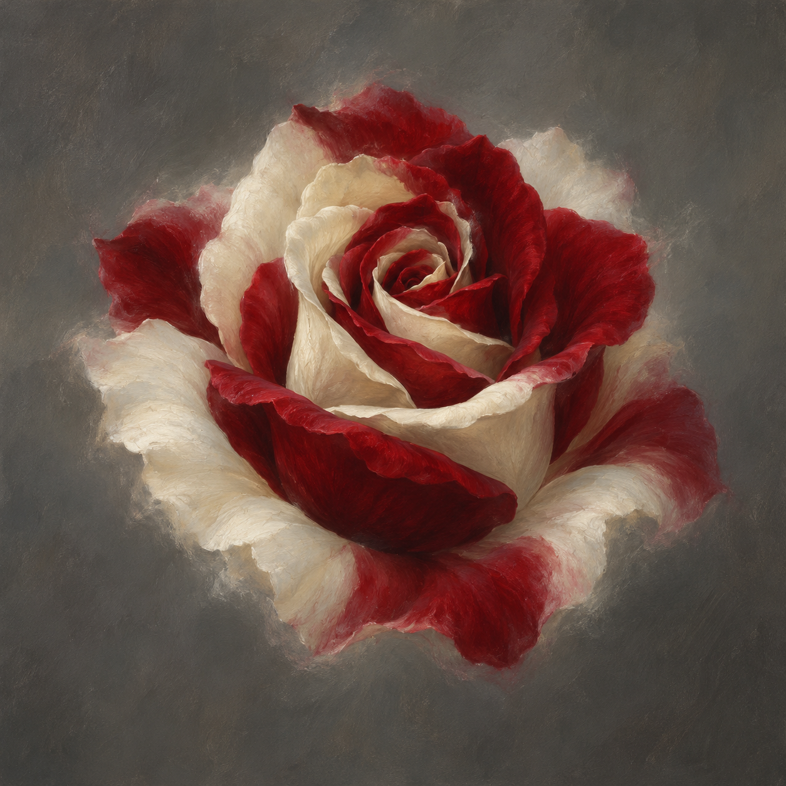

# 嘴上的紅白玫瑰

斯剛德斯說史蒂芬與坡夫人嘴上各有一朵紅白相間的玫瑰；史蒂芬伸手摸嘴，沒有摸到任何東西。本設定只鎖定花種、兩色及出現於嘴部，採斯剛德斯的視覺。無法由此確定所有人都能看见、觸碰，或斯剛德斯已能解除它。

設定圖將花形單獨提取到中性灰背景；花瓣數、紅白分布、尺寸與柔軟邊界是視覺詮釋。它不是植物標本或可摘走的花，不加花莖、刺、鐵鏈、縫線、血、符文或光環。

生成方式：內建 imagegen。設定稿 prompt：Use case: illustration-story. Asset: reusable spell reference for Jonathan Strange & Mr Norrell chapter47, setting id silencing_red_white_rose. A single small red-and-ivory-white variegated rose blossom, seen in a slightly three-quarter view, centered on neutral muted grey background, restrained English literary oil painting with delicate tactile brushwork. Alternating deep red and ivory petals within ONE bloom, not two roses. Softly defined outer edges suggest a visual enchantment rather than a tangible flower. NO stem, NO leaves, NO human face. No text, captions, watermark, labels, gore, chains, stitches, runes, glitter or halo. Exact shape and petal arrangement are interpretive; do not depict release or removal. One image only.

v1已視檢：一朵花、紅白同在、無莖葉、無字與水印，未暗示解咒。

