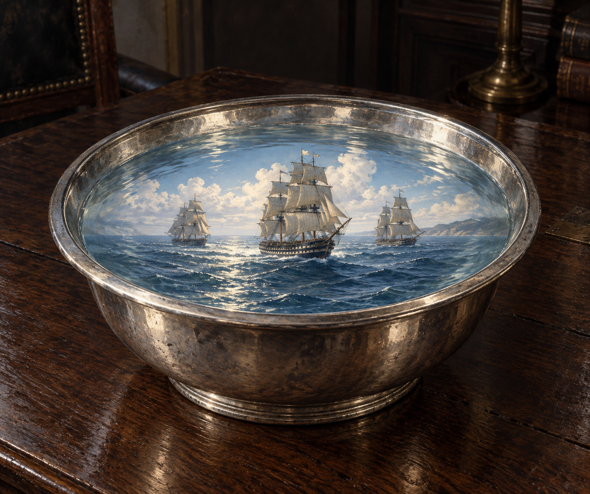

# 幻影銀盆 (Silver Basin of Visions)

## 已確認視覺特徵

- **形體**：直徑約一尺的銀盆，置於海軍部會議室內；盆中盛乾淨的水。
- **魔法表現**：水面浮現會動的幻影，能看見蔚藍海面、白雲、破浪航行的軍艦，以及甲板上走動的小人。
- **本章已知內容**：第 012 章中映出三艘英國軍艦；幻影可供在場者辨認船名與艦上人物，但諾瑞爾明確表示這門技術不準確，不能由此推知完整位置或更多情報。
- **光線效果**：盆中地中海的熾烈天光照進冬日昏暗房間，映亮俯身觀看者的臉。

## 劇透邊界

設定只鎖定第 012 章海軍部示範的幻影銀盆與三艘軍艦；不延伸後續幻影內容、軍事結果或未讀人物發展。
