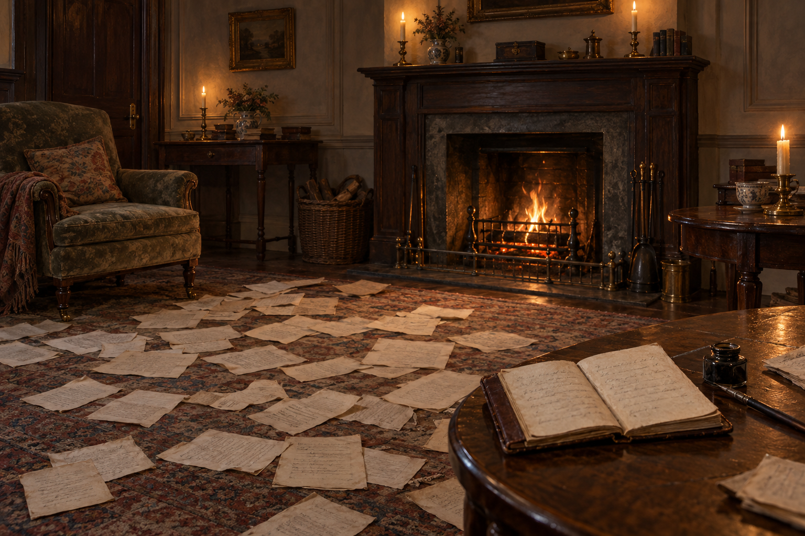

# 客廳稿紙與家用帳簿

## 來源與已確認元素

第35章的家中客廳地毯鋪滿小稿紙，內容涉及文章、咒語與談話筆記；喬納森拿阿拉貝拉的帳簿繼續記寫。壁爐在本段出現。帳簿是普通家用物件，不當成魔法書；本次與散紙、客廳環境合建設定，供「未被接收的話」場景引用。

## 詮釋與限制

深木色、灰牆、椅子、地毯花紋、帳簿的褐色裝幀與桌上位置、燭光、冬日晚光都是視覺提案。小說未限定帳簿外觀或房間平面，也沒有確認它與第26章新居房間是同一間；不沿用搬家稻草或行李狀態。場景可調整桌椅位置，保留散紙、樸素小帳簿與家居質地。紙上筆跡不可讀；不把樹木魔法或鏡中道路具象化。

## 生成與視檢

內建 imagegen，無人物的橫幅歷史奇幻油畫設定稿。暖火、舊地毯、散落小稿紙、近景普通褐色帳簿，無可讀文字、標籤、水印、鏡子或超自然效果。已開圖視檢，帳簿與紙張存在，牆上裝飾只為無人風景。

