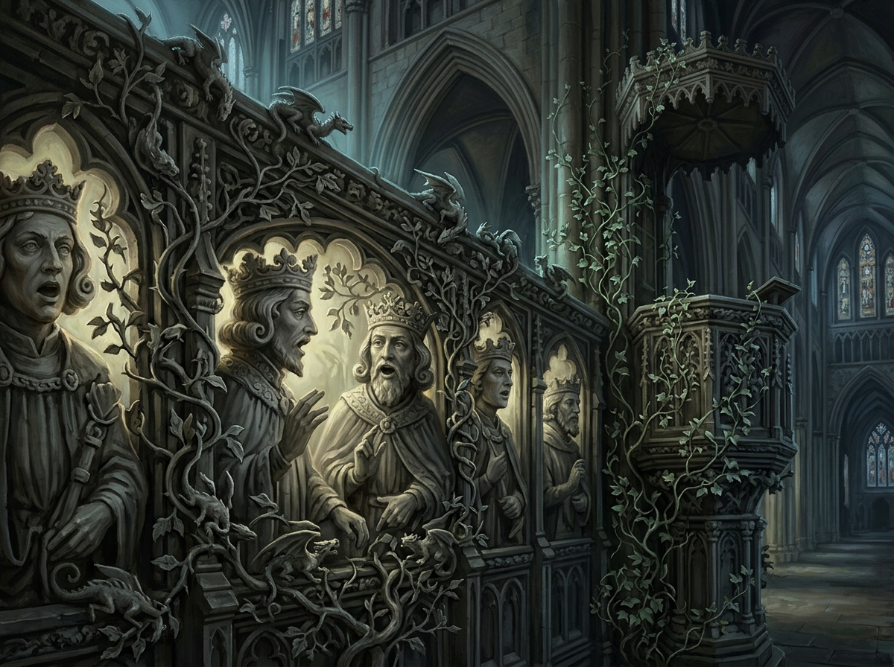

# 約克大教堂說話的石頭 (The Speaking Stones of York Minster)

## 外貌與構造
- **石像群像**：石屏基座上十五位鬈髮國王石像爭吵不休；石柱椽子上的小雕像揮動粗短石臂吶喊；米開朗基羅仿造雕像以義大利語追憶羅馬豔陽。
- **動態活化**：兩條與小臂長短相仿的石龍在雕刻的山楂樹枝葉間靈活追逐遊走；石雕常春藤與荊棘在微風中生長蔓延，攀上講壇與經書。
- **聲響與氛圍**：粗礪刺耳如石塊摩擦的古老低語，伴隨瀰漫於大教堂內部的升騰石灰沙塵。

## 敘事意義
諾瑞爾先生向英格蘭展現的第一個偉大奇蹟。它不是無中生有的幻影，而是強行喚醒石材沉睡千百年的客觀歷史記憶，宣告實踐魔法全面重回不列顛。
