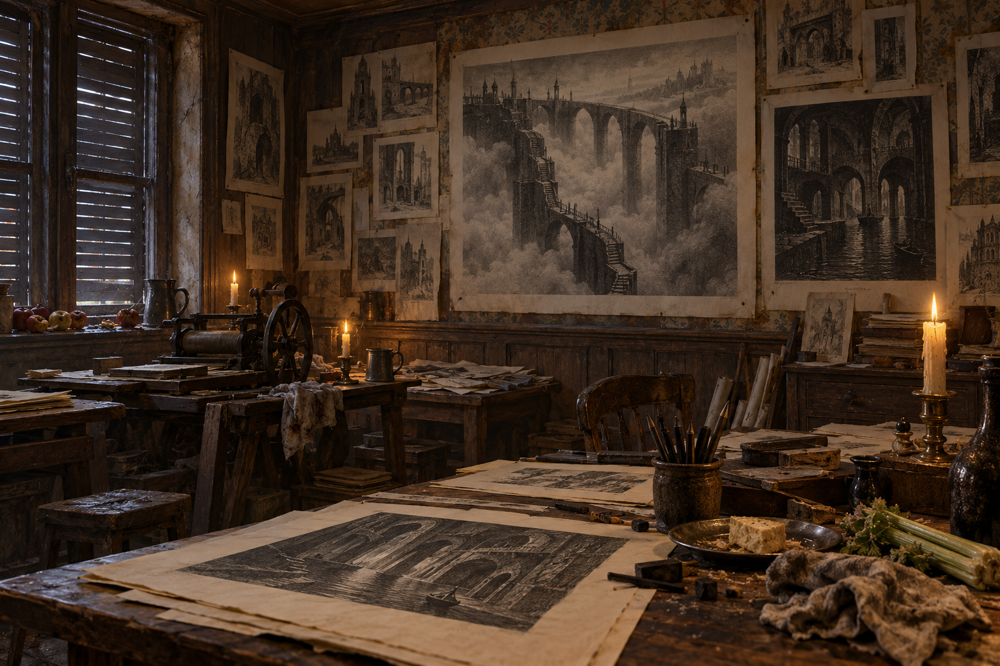

# 斯皮塔菲爾茲的版畫工作室

出處：《英倫魔法師》第48章〈版畫〉，1816年倫敦。桌面厚紙、墨污布、錫盤與乳酪皮、筆炭和舊芹菜；髒壁紙、木護牆上密貼圖畫；閉窗、窗臺腐蘋果、燭光與室內霧氣取正文。實際房間尺寸、家具排列、色溫是視覺詮釋，不作建築復原。

巨石橋跨越霧中空隙，細梯沿巨墩下降；幽暗通道與運河取自紙上版畫。版畫受到雕刻師熟悉的建築語彙影響，不是客觀地圖，也不能確定是哪一個仙境國家。圖畫保持紙張質地，禁止把畫框改成真實魔法通道。

此為無人物設定稿；雕刻師、助手與小女僕均未建立外貌，不在本次圖中出現。初次與最近引用皆048。

生成方式：內建 imagegen；完整 prompt 見[同章閱讀心得展品卡](../../../ReadingReflections/sirius_strange_ch048_another_opinion.md)的設定稿段落。v1已視檢：閉窗、厚紙墨布、腐蘋果、筆炭芹菜與乳酪盤可見，巨橋與幽暗通道保持紙上版畫；無人物、可讀文字或水印。印刷機、精確家具與橋形是畫面詮釋，不升格為正文確定細節。

