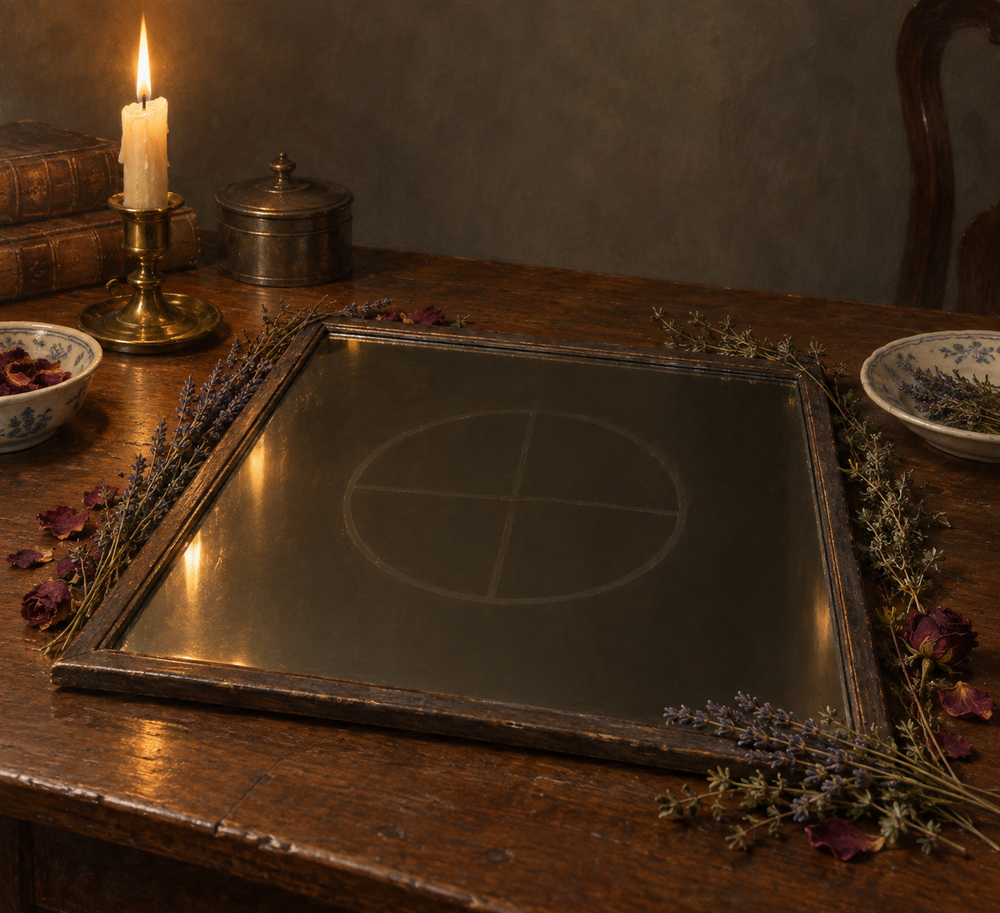

# 刺探咒與乾花鏡面 (The Spy Spell and Dried-Flower Mirror)

## 外觀與用法

- 第二十二章中，斯特蘭奇與亨利把客廳牆上的鏡子摘下，平放在桌上。
- 咒式要求乾花環繞鏡面；雷蒙夫人拿出薰衣草、玫瑰與百里香。斯特蘭奇用手指在鏡面畫圈、分成四份，再敲三下並念出咒語。
- 鏡面隨後映出另一處書房，能看見房間與其中人物，卻聽不到聲音。

## 敘事與未知處

鏡子把斯特蘭奇偶然獲得的咒語連到諾瑞爾的書房，讓他第一次親眼看見另一位魔法師。鏡框材質、形狀和這道咒語的機制尚未說明；設定圖採簡樸的木框鏡作視覺提案，不把提案當成小說已確認的細節。
