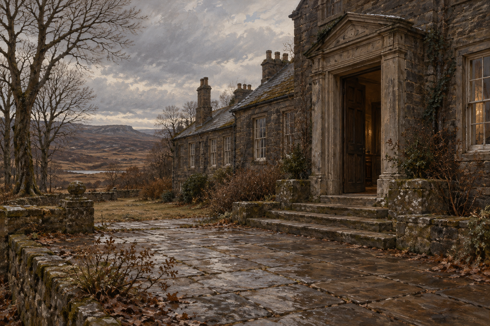

# 望穿堂的門階

正文確認望穿堂長而低矮、以深色石材蓋成，位於偏遠棕色荒野與高樹間；校舍修繕後，12月中旬齊爾德邁斯坐在門口台階等斯剛德斯。圖中沒有招牌、學生或已開學的訊息。

門框造型、階梯數量、鋪石排列、枯枝與微弱室內暖光是視覺詮釋。圖中藤蔓與少量落葉延續偏遠宅院的質感，不代表修繕未曾發生；不鎖定建築年代或暗示魔法來源。場景參考無人物，v1已視檢。

設定稿prompt：illustration-story；Jonathan Strange & Mr Norrell chapter41；starecross_hall_steps；長低深色石屋、淺石階、荒野與高樹；12月陰天；無人物的環境三分之四視角；沉靜英國文學油畫質地；無文字、水印、符文、幽靈、學生或標牌。

