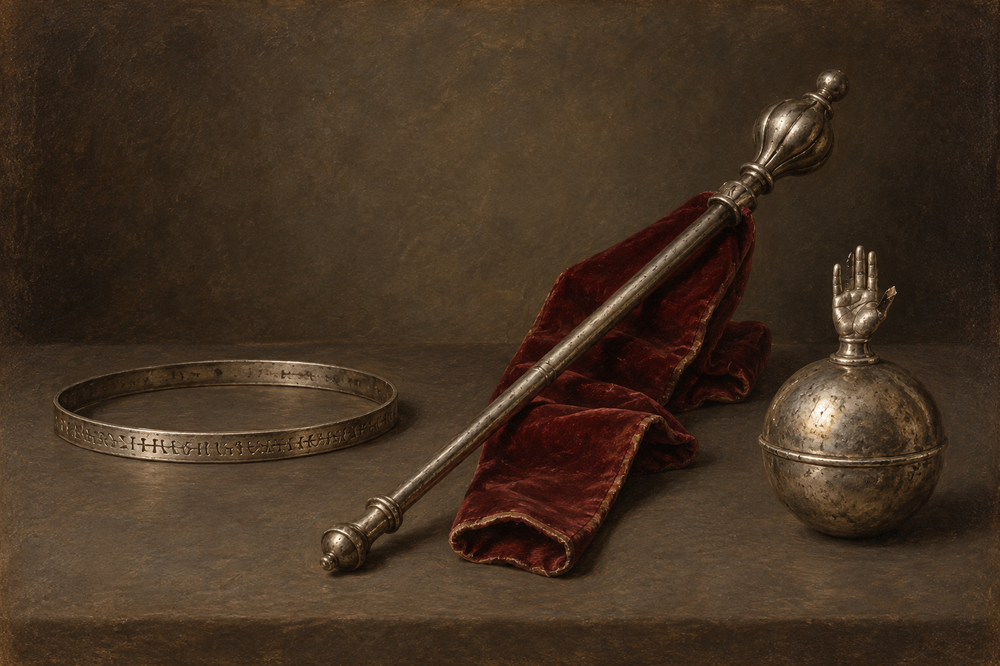

# 史蒂芬不情願的王者贈禮

## 已確認的物件

- 一只纖細銀頭環，大小正好適合史蒂芬；環面刻著古怪符號與奇異字母，無法辨讀。白髮先生承認他把史蒂芬的一頂帽子變成頭環。
- 一根包在舊紅天鵝絨中的長銀杖。白髮先生把它說成古代英國王權的傳家物，但史蒂芬沒有接受這項來源說法。
- 一枚沉重、斑駁的銀球，頂端不是十字架，而是一隻向上張開、折斷一指的小手；這是白髮先生使用過的徽記。

## 視覺約束

三件物件都呈現為被迫收下、攜帶不便的贈禮，不替銀杖的歷史主張背書，不把手掌徽記解釋成已知的魔法機制。符號與字母保持不可讀。
