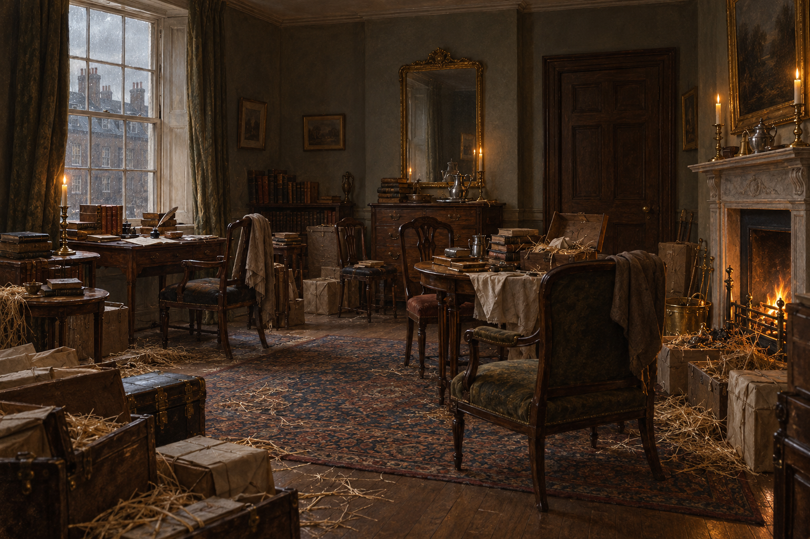

# 蘇活廣場新居房間

## 已確認的場景元素

- 第二十六章揭示這是倫敦蘇活廣場一間普通而舒適的住宅房間；屋主新近搬入，仍在拆行李。
- 房內有窗邊小寫字桌、書與墨跡斑斑的小冊子、各式桌椅、鏡子、壁爐、行李箱、包裹與散落的墊箱稻草。稻草延伸至壁爐附近。
- 房門正對一面大鏡子；書與搬家物件混在一起，形成臨時且凌亂的工作空間。

## 視覺約束

畫成有人居住、正在整理的倫敦房間，不與諾瑞爾井然有序的書房混同。只保留第二十六章已說明的元素；房屋的確切平面、裝飾風格與後續用途仍未鎖定。
