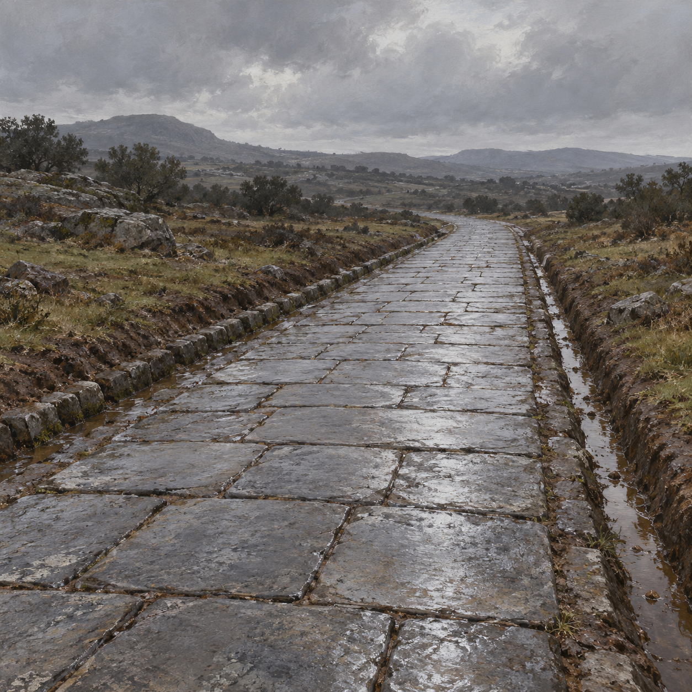

# 前線的臨時羅馬式道路

第29章裡，威靈頓拒絕遇雨成泥的白灰與砂石路，也顧慮卵石磨靴、拖炮困難。他要求羅馬式大道：平整石板嚴密拼合，兩側各有一道排水溝。斯特蘭奇當夜開工，翌晨道路已就位。

設定鎖定濕石板、低矮路緣與兩側露天溝渠。採經典英國歷史奇幻油畫質地，以冷灰石面、褐色濕土與葡萄牙鄉野的低調綠色呈現。道路精確寬度、石材種類、彎道形狀與路基斷面均未在文本確定，圖像只作可重複引用的視覺方案，不當成考古測繪。

道路須在領頭團到達前一兩小時完成，最後一兵離開一小時後消失；文本未說明消失時的視覺效果。設定與場景不添加符文、光束、漂浮石塊、透明路面或崩塌動畫。此卡只使用第29章已知內容。

## 設定稿規格與驗收

- setting id：`temporary_roman_road`；中性三分之四道路視圖，無人物，以路面和排水結構為主。
- 平整石板密合，路緣左右各一條可見排水溝；周圍保持濕泥與低草，不加入新橋梁或建築。
- 無文字、無水印、無魔法光效；v1 已打開原圖核對，石板與左右排水溝均可見，無人物或文字。
