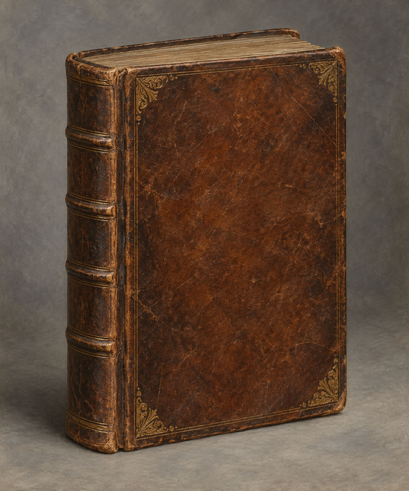

# 傑里米・托特《英格蘭魔法》

## 已確認資訊

- 第二十四章中，諾瑞爾把此書送給斯特蘭奇，說它是傑里米・托特為其兄霍雷斯・托特所寫的傳記。
- 斯特蘭奇在諾瑞爾書房以這本書示範自己的法術，最後讓書的實體出現在鏡中，而桌上只留下鏡像。

## 視覺約束與未知處

書名與作者可在設定文字中標示；圖像封面只用無字的舊皮革與磨損邊角，不生成可讀字樣。尺寸、裝幀樣式及書上是否有其他標記未由本章確認，均作繪圖提案，不升格為小說事實。
