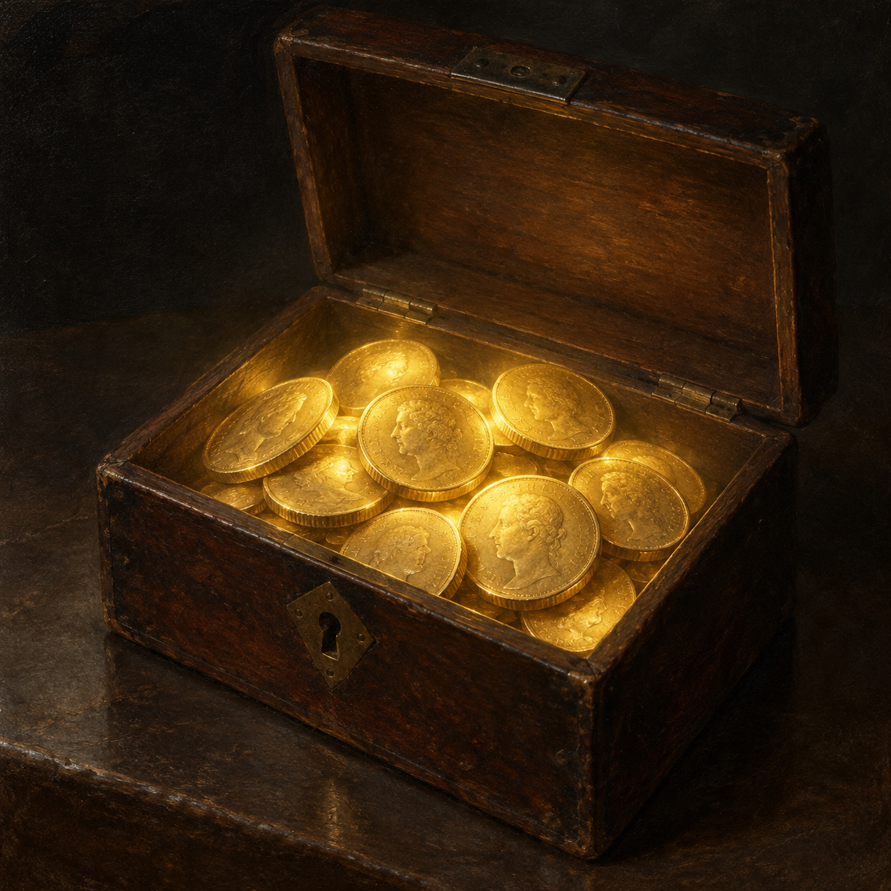

# 來歷不明的二十五枚幾尼

## 已確認的特徵

- 二十五枚嶄新、幾乎沒有磨痕的金幣，出現在布記店的錢匣中，帳目因此多出一筆。
- 關上錢匣時，店內光線隨之消失；金幣在打開時發出柔和的淡黃色光。
- 光照下的人物外貌與桃木抽屜上的文字在敘述中呈現異常變化，但人物沒有察覺；金幣來源仍未知。

## 視覺約束

呈現古金幣及其不尋常的柔光，不刻畫確定的失主、施法者或作用機制，也避免可讀的幣面文字。