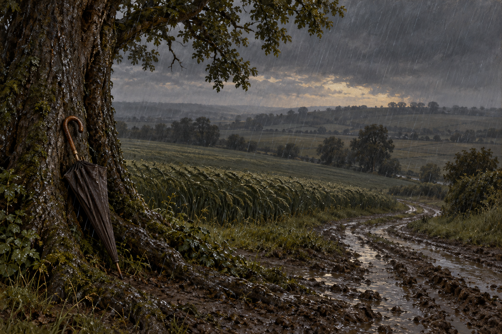

# 滑鐵盧榆樹下的雨夜

第40章中，威靈頓讓斯特蘭奇守在下坡道路旁的榆樹；戰前夜各師沿滑鐵盧南面矮嶺就位，雷雨不斷。他躲在傘下施行「未來徵兆之臆測」，士兵與戰馬在他的感知中消失，留下雨水、暮色與麥浪。

## 已確認與詮釋

- 已確認：榆樹、下坡道路、南面矮嶺、雨水、暮色、麥田，以及他攜帶的大綢傘。
- 設定稿鎖定環境與傘的材質，不重現預兆過程。樹冠、道路曲線、麥田邊界、傘色及地面擺放位置是視覺詮釋，並非考據復原。
- 場景圖中的空地屬斯特蘭奇當次感知，不表示士兵真的被移走，也不預先替消失者指定身分與結局。
- 不添墓碑、屍體、透明鬼魂、未讀事件、光圈或可讀文字；雷聲不強制轉成畫面中的閃電。
- v1已視檢：榆樹、麥田、泥路、雨水與閉合傘可見；無人物、文字或水印。首次與最近引用皆040。

## 設定稿 prompt（內建 imagegen）

Use case: illustration-story. Work Jonathan Strange & Mr Norrell, chapter 40, setting id waterloo_elm_rain. Neutral environment reference, no people. June 1815 evening rain beside an elm tree near a descending muddy road and a low ridge south of Waterloo; broad dark wet grain fields bending in wind, dim gray dusk, rain clearly visible, old elm bark and wet roots in foreground. A large plain closed silk umbrella with wooden shaft rests against the tree to establish its period material; umbrella charcoal brown, an interpretive choice. Landscape three-quarter environment view, restrained classical British historical fantasy oil painting with fine tactile brushwork, muted green gray umber palette, natural light only. Tree shape, road curve and field arrangement are interpretive, not a historical reconstruction. No tents, armies, people, animals, bodies, grave markers, ghost effects, magic glow, text, signatures, watermarks or modern objects.
