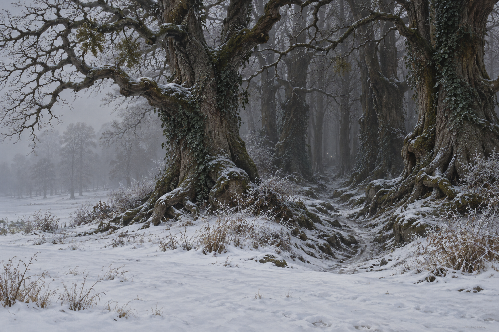

# 溫莎雪園裡的異常樹林

第33章、1814年11月：霧中的小樹叢突然變成深密幽暗的古林。巨大枝杈扭曲，樹根蜿蜒盤踞，樹幹覆有青藤與槲寄生；林間小路有深坑、冰碴和霜凍野草。遠處幾道細光暗示一所不可能出現在此處的房子，但本設定不畫出房子的具體外觀。

樂曲使斯特蘭奇把遠光理解為舒適居所與藏書室；破幻後，遠光只剩幾個不起眼的白點。設定圖固定後者的冷暗視覺，不能把幻想中的家具、酒或圖書館當成已看見的事物。公園與林邊的空間配置是構圖提案；施法機制與吹笛人外貌未鎖定。章末五棵光禿山毛櫸的狀態不混入這張設定。

## 設定稿 prompt（built-in imagegen）

Use case: illustration-story. Work Jonathan Strange & Mr Norrell, chapter33, setting id windsor_enchanted_wood. Empty snow-covered Windsor park in gray winter fog. Impossibly deep dark forest of ancient trees, twisted limb-like branches, serpentine roots, ivy and mistletoe. Narrow pitted path rimmed with ice and frost grass. A few extremely faint white pinpoints suggest an unseen dwelling; no visible building, warm library interior or human figure. Classical British historical fantasy oil painting. No moon, magical symbols, text, watermark or later five bare beech trees.

