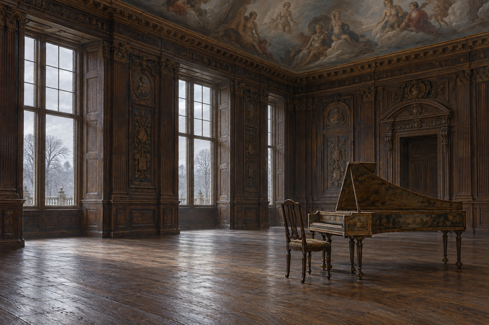

# 溫莎國王的冷室與大鍵琴

第32章確認：房間高大寬敞，四壁是雕紋橡木牆圍，天頂畫著立在雲中的先王與神話人物。腳下無地毯，室溫低，只有一把椅子和一架破舊大鍵琴。國王在琴邊背對房門坐著；窗外是白霧與冬日枯樹。

## 視覺約束

大鍵琴保持十八世紀弦樂鍵盤樂器的木身與琴鍵輪廓，不用現代鋼琴替代。琴的雕紋、尺寸、牆板配置與窗的位置是詮釋，沒有在正文指定。只畫一把椅子，不添豪華床、地毯或火爐；冷光與大片空地保留房間的凄寂。天頂人物可模糊呈現壁畫，並非活人或預言。

## 設定稿 prompt（built-in imagegen）

Use case illustration-story. Work Jonathan Strange & Mr Norrell chapter 32, setting id windsor_king_music_room. Empty broad high royal chamber in Windsor, November 1814. Intricately carved oak wall paneling and a partially visible painted ceiling of vague ancestral and mythological figures standing on clouds. Bare wooden floor with no carpet. Exactly one chair beside a shabby old eighteenth-century wooden harpsichord with historical keyboard and long wing-shaped case, NOT a modern piano. Few furnishings; large cold empty space. Pale foggy winter light, distant leafless trees through window. Three-quarter environment reference, classical British historical fantasy oil painting, aged oak and subdued gray light. No people, bed, additional chairs, rug, fire, crowns, text, watermark or magical effects.

