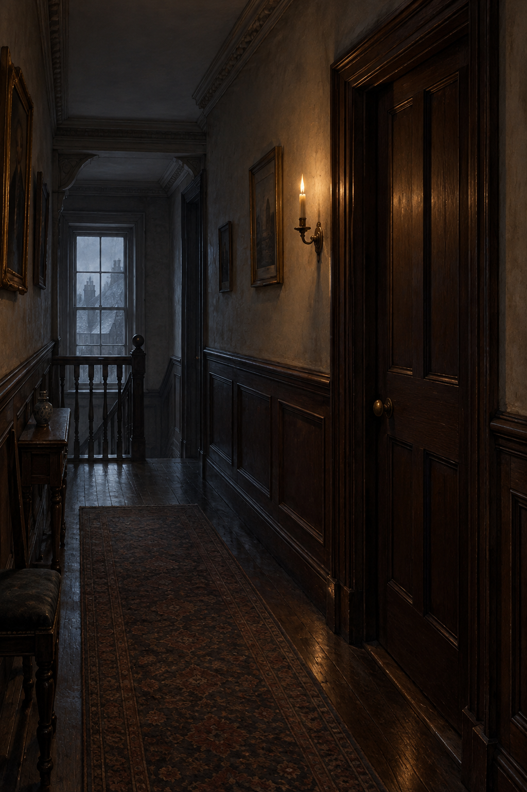

# 布倫瑞克廣場三樓病室門口

## 已確認的場景元素

- 布倫瑞克廣場一所裝修華美、卻因陰冷而沒有舒適感的倫敦宅邸。
- 諾瑞爾一行由僕人羅伯特領路，走到三層一間小屋的門前；本章在門口收束，尚未揭示房內施法結果。
- 宅內寒冷昏暗；迎客與領路的光源是僕人手中的蠟燭，門外仍可見樓道與門框的深色木質。
- 門口同時承載兩種觀看方式：德羅萊特想召集觀眾見證奇蹟，諾瑞爾則要求獨自進入房間。

## 視覺約束

只畫三樓房門前的等待與分歧，不畫復生、施法光效、房內病床細節或任何後續結果。保留攝政時期倫敦宅邸的深色木作、蠟燭冷光、狹窄樓道與未開啟的門，讓門本身成為尚未被證明的邊界。
