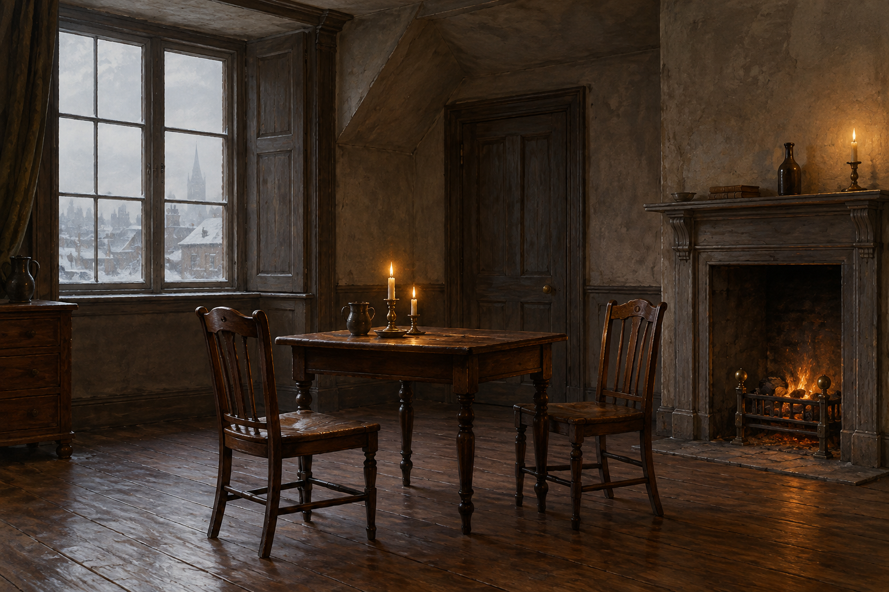

# 沃頓記咖啡館頂樓雅間

第三十章明示史蒂芬與白髮先生坐在牛津大街沃頓記咖啡館頂樓的雅間；這裡也是「黎明男兒」的聚會場所。第十九章已有咖啡館的聚會與隔間，但本卡只固定本次談話使用的頂樓空間。

## 畫面約束與開放處

深木桌椅、灰褐牆面、簡樸壁爐、冬季窗光與一盞燭火，是攝政時期室內的視覺詮釋，並非正文逐件確認的家具。供兩人坐下交谈的空間保持狹小、平常，沒有王座、王冠、魔法光效或可讀招牌。窗外不指定地標；談話時間與家具位置未明，不鎖定為故事事實。

## 設定稿 prompt

Use case: illustration-story. Work: Jonathan Strange & Mr Norrell, chapter 30. Setting id: wootton_upper_room. Empty top-floor private room of Wootton's coffee house on Oxford Street, London, winter 1812. Neutral three-quarter interior view, small dark wooden table and two facing wooden chairs, worn gray-brown plaster, simple fireplace, pale winter window light and restrained candle warmth. These furniture details are interpretive, not textual facts. Classical British historical fantasy oil painting, finely painted wood grain and wool-like muted textures. No people, no text, no lettering, no watermark, no royal regalia, no magical glow, no modern objects.

