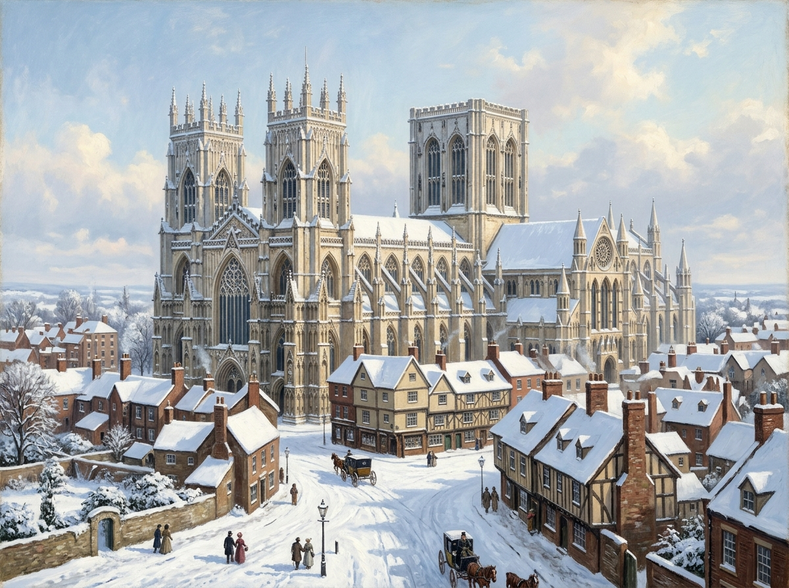

# 雪中約克大教堂 (York Minster in the Snow)

## 外貌與構造
- **建築規格**：英格蘭北部最巍峨壯麗的哥特大教堂，雙方塔雄偉高聳，精美石雕飾帶與尖拱窗在古城屋頂之上拔地而起。
- **冬雪景致**：大雪將約克的一切泥濘覆蓋，晨曦中純白積雪反射出令人目眩的清冷強光，與古老石壁的灰藍陰影形成強烈反差。
- **南門廊 (South Porch)**：幽暗深邃的哥特拱門，成為魔法師們跨入全新魔法時代的歷史分界線。

## 敘事意義
神聖信仰與古老超自然力量交匯的舞台。諾瑞爾先生將其選為施展奇蹟的場所，使這座莊嚴的大教堂成為英格蘭魔法實踐重現世間的唯一見證。
