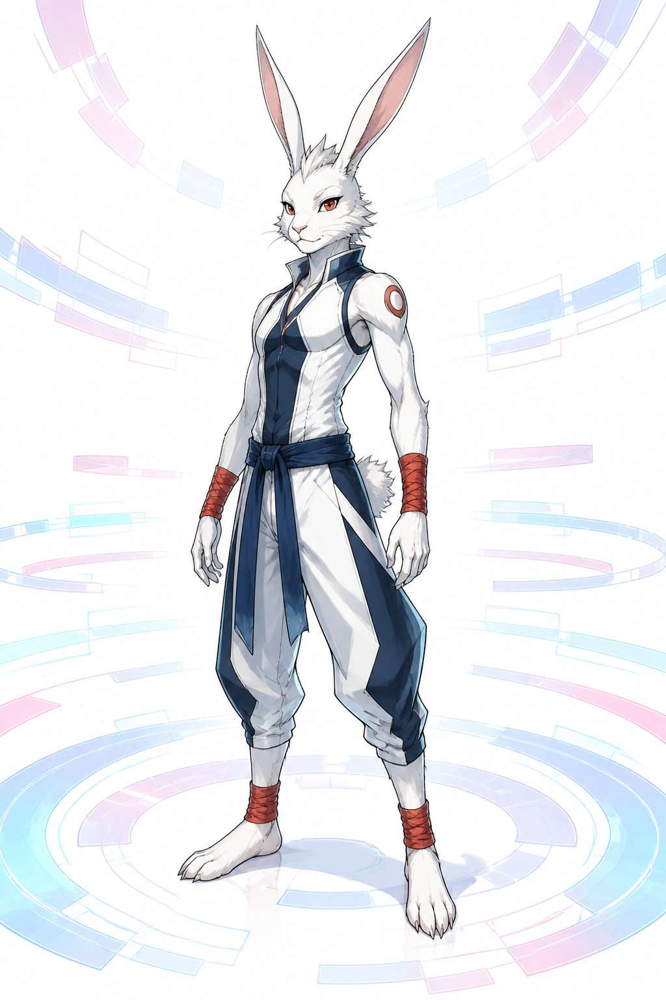

# King Kazma 設定稿

**已確認外觀：** 白色擬人兔型 OZ avatar，長直耳、纖瘦而敏捷的武鬥身形；服裝以深藍與白色為主，手腕與腳踝有紅橙色纏帶。設定稿採中性三分之四全身視圖，不預先加入受損、勝利姿勢或其他角色。

**敘事功能：** King Kazma 是 OZ 的格鬥象徵，讓虛擬世界的競技、群眾信任與防衛力量可被具象地看見。後續場景可改變動勢與光線，但保留白兔輪廓、深藍白服與紅橙護腕作為可辨識基準。

