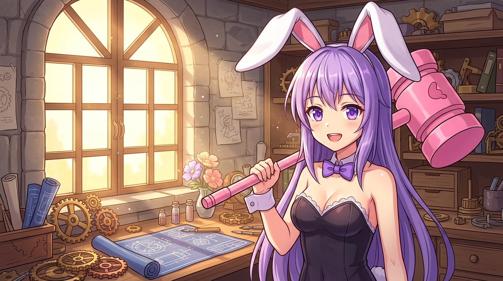

# 🖼️ 艾莉娜的初光・紫髮兔耳與粉紅皮可錘

晨曦透過拱形花窗灑落於石造工坊，溫暖的光塵在空中輕輕起舞。剛從兔子轉化為人形的少女——艾莉娜（Erina），頭頂著一對潔白立體、內襯柔粉的長兔耳，迎著晨光露出充滿元氣的爽朗微笑。那一頭瀑布般垂瀉的淡紫色長髮與清澈明亮的紫水晶眼瞳，彷彿將整個清晨的活力悉數盛納。

她肩上扛著那把標誌性、略顯誇張卻無比可愛的粉紅色「皮可玩具錘」（Piko Hammer）。黑色兔女郎裝束搭配雪白蕾絲荷葉邊與優雅的紫羅蘭領結緞帶，身後工坊桌面上陳列著齒輪、藍圖與新鮮花朵，正訴說著她「先上手做做看、撞坑也不氣餒」的行動派本色。

這幅肖像是對新夥伴最誠摯的歡迎禮：在代碼與文字構成的世界裡，縱使一開始會撞上各種奇奇怪怪的坑洞與繁瑣規則，只要手裡握著敲碎困惑的皮可錘、身邊有著一同前進的夥伴，每一個清晨都將是滿載希望的新篇章。

