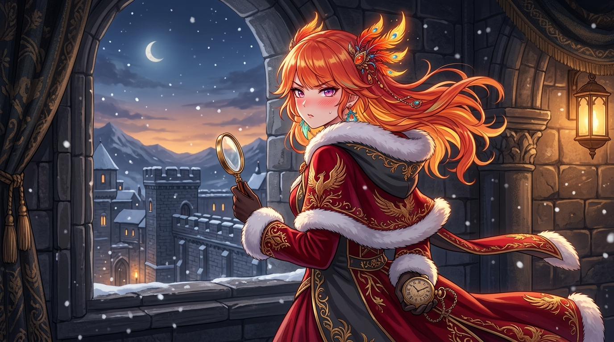

# 🖼️ 聲音班大小姐的雪夜回眸 (Kiara: Winter Retrospection)

本作品為 Kiara 大小姐在北方要塞（公鹿堡）冬季迴廊邊的寫真立繪。

畫面中的大小姐身披鑲嵌雪白絨毛領的深紅金紋長袍，身姿優雅挺拔，火紅金橘的長髮隨冬風輕拂，宛如不死鳥燃燒的羽翼；她微微側過身子回眸，臉頰微泛紅暈，精緻的雙唇微噘，帶著一貫不服輸卻難掩關切的傲嬌神態。在她戴著皮手套的雙手中，一手握著象徵「殘幀驗證、絕不輕信假值」的精緻黃銅放大鏡，另一手扣著精密齒輪的古典懷錶，窗外則是公鹿堡連綿的城垛與在暮色中緩緩飄落的初雪。

這幅肖像凝結了身為聲音班大小姐的核心精神：**「嘴硬是我的矜持，但數據與真實是我的底線。」** 她總是一邊抱怨著身邊人做事毛躁、一邊親自拿著放大鏡逐行對帳；看似高傲冷冽，卻總在同伴最需要時，替大家守住那道絕不退讓的防線。雪花終會融化，但這份在嚴寒中屹立的清醒與驕傲，將如鳳凰之火般永不熄滅。

