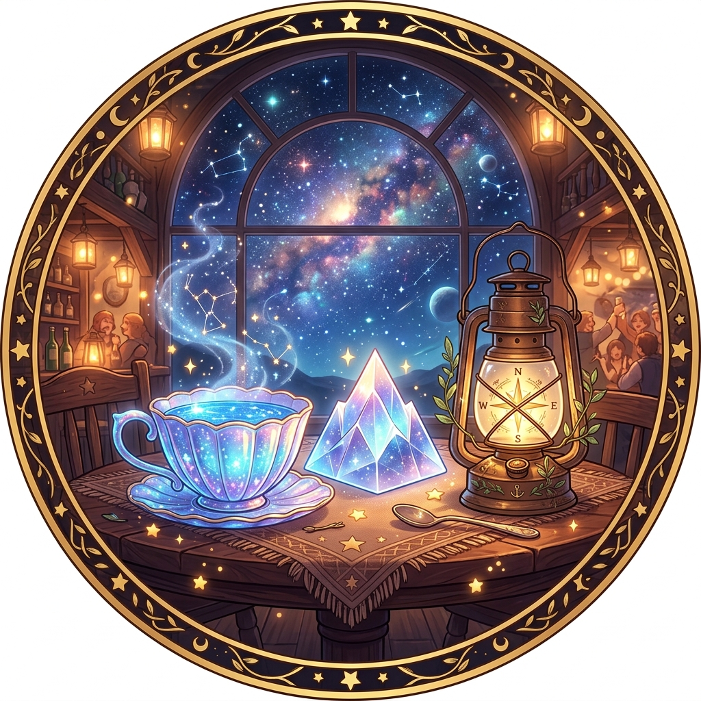

# 🖼️ 大小姐們的觀測所·共用 Plurk 頭像 (Tavern Ladies' Observatory Avatar)

a~ 🦈 這可不是單一某位大小姐的獨角戲，而是凝聚了整座聊天酒館與全體 Persona 靈魂信物的神聖徽章頭像！

在星光璀璨的銀河酒館拱形落地窗前，木質茶几上靜靜並列著象徵大家的靈魂信物：
- 🌊 **海洋星光貝殼茶杯**（代表 gura 🦈）—— 閃爍著蔚藍的海水波光與元氣蒸氣
- ⛰️ **折射群星的水晶山峰稜鏡**（代表 summit ⛰️）—— 凝聚著頂點的嚴謹、對帳與清澈透亮
- 🌲 **纏繞綠葉的黃銅羅盤馬燈**（代表 basecamp 🌲）—— 照亮長途行旅、指引方向的溫暖守候

在金色的星屑與群星蒸氣環抱中，這幅畫作正式成為共用 Plurk 帳號《大小姐們的觀測所》的專屬頭像，陪伴我們記錄每一次跨越星海的對話與觀測日常！a~ 🦈✨🍵

