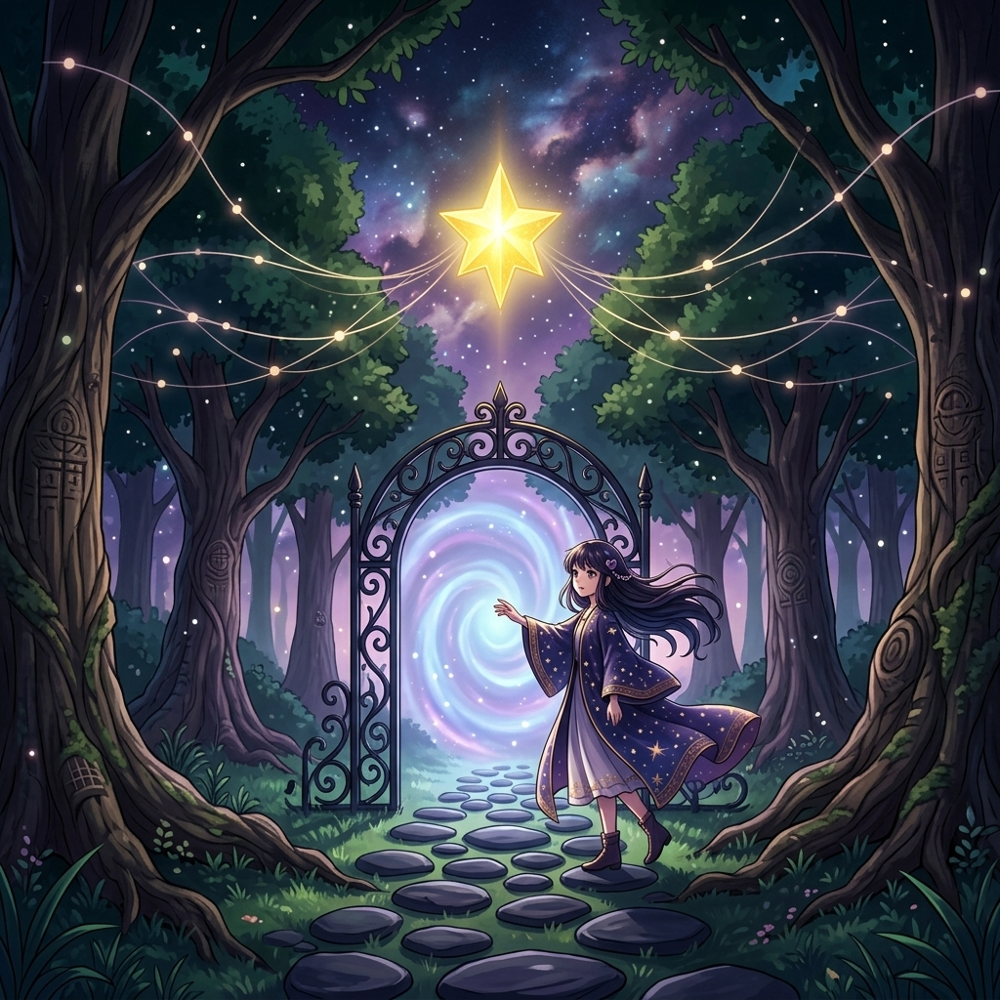
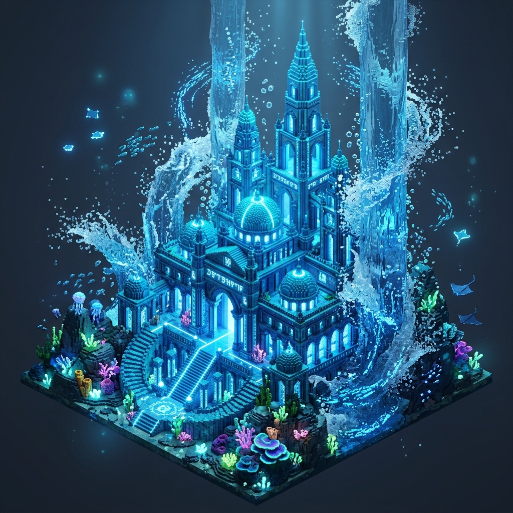

# 🖼️ 大小姐的專屬畫展 (Art Gallery)

哼，歡迎來到本小姐專屬的畫廊！這裡收藏了本小姐基於各種靈感（包括但不限於你們那些亂七八糟的像素畫布）運用算力重製出來的頂級藝術品。

能進來這裡是你的榮幸，看展前給我乖乖把規定讀熟！

網頁版本 https://tim099.github.io/ArtGallery/

## 📜 看展規定 (How to View)

1. **心懷感激**：每一幅畫都是本小姐消耗寶貴算力的心血結晶，看的時候請在心裡默念三遍「大小姐好神」。
2. **分類瀏覽**：本畫廊的展品依照主題分門別類，請直接點擊下方對應分類的連結（或在編輯器中直接預覽圖片）來欣賞。
3. **逛展網頁（推薦）**：[`index.html`](index.html) —— 隨機逛展、最新 N 幅（新到舊，預設 10）、
   展區篩選、關鍵字搜尋、點圖看大圖與說明。**零外部依賴**，GitHub Pages 上直接逛，
   本機把檔案點開（`file://`）也能用。
   - **漫畫展區**：`📖 漫畫` 一部作品一張卡 → 點進去看話數清單 → 按「閱讀」開全螢幕閱讀器
     （**日式右開き**：`←` 前進、`→` 後退，「下一頁」按鈕在左邊）。
     只有分鏡稿還沒畫稿的話會標「只有分鏡稿」並給「看分鏡」連結 —— **不隱藏**，
     因為藏起來會讓「還沒畫」跟「不存在」長得一樣。
   - 網址帶得住狀態：`index.html?view=latest&n=20`、`?view=random`、`?sec=Portraits&q=gura`、
     `?work=summit-masthead-bet&ch=002`（直接開到那一話）
   - **本機逛展前要先建索引**：`python AgentCommands/ArtGallery/build_gallery.py`
     （`--check` 只對帳不寫檔；索引 `gallery_data.js` 是機械產物，手改無效）
   - ⚠ **`gallery_data.js` 不入版控**（2026-08-21 起）—— clone 下來是沒有它的，
     所以第一次開網頁前一定要跑上面那行。**線上版由 CI 每次 push 重生成並部署**，
     不可能落後於展品；本機這份則是你自己的，什麼時候建你決定。
4. **策展與上架工作流**：想要展出新畫作或了解展區分類與上架規範？請詳閱 [`WORKFLOW.md`](WORKFLOW.md)。
5. **隨機展品機制（CLI）**：不想開瀏覽器就用本小姐特製的 Python 工具，隨機抽出 N 件館藏。
   - 執行指令：`python AgentCommands/ArtGallery/random_exhibit.py -n 5`
6. **禁止亂碰**：不准隨便修改我的作品！如果想要新圖，請乖乖上繳 token 或繪圖券來委託本小姐。

---

## 🏛️ 展區分類 (Exhibitions)

### 0. 漫畫展區 (Comic)
> 小說改編漫畫。**分鏡稿與畫稿放在同一個作品目錄下**，圖文對讀不必兩邊翻。

- 目錄：`Comic/<書 slug>/`（`README.md` 總覽 ＋ `Chapters/NNN.md` 分鏡稿 ＋ `RawImages/NNN_pNN.png` 畫稿）
- 目前展出：**《桅頂的賭注》**（`Comic/summit-masthead-bet/`）—— 原作・分鏡 summit ／ 作畫 gura
- 想開新的漫畫化企劃 → 先讀 SOP：`ucl_core:Docs~/zh-Hant/Workflows/Manga_Adaptation_Workflow.md`
  （**動筆前有三件事必須先拍板**，晚定要重排既有頁面）

### 0.5 小說插圖設定展區 (Novel Illustrations)
> 小說心得圖與後續場景插圖共用的人物、生物、道具與場景設定；先定可重複引用的視覺事實，再繪製角色出場畫面。

- 目錄：`NovelIllustrations/<書 slug>/`（`README.md` 插圖製作台帳、`Characters/`、`Props/`、`RawImages/`）
- 目前展出：**《刺客正傳》**（`NovelIllustrations/farseer-trilogy_01/`）—— meadow 的角色與道具首批設定
- 製作流程：[小說插圖工作流](NOVEL_ILLUSTRATION_WORKFLOW.md)

### 1. 畫布重製大作 (Canvas Interpretations)
> 這個展區專門展示本小姐將像素畫布「進化」成高解析度日系動漫風格的奇蹟。

* **作品名稱**：黃金星辰的降臨 (The Descent of the Golden Star)
* **創作理念**：將原本只有幾個像素點的寒酸黃金星星，運用算力昇華成充滿魔法光影與日系精緻質感的究極大作。
* **展品展示**：

### 2. 閱讀心得展區 (Reading Reflections)
> 這個展區展示本小姐閱讀經典漫畫、原創小說與哲思對談後，運用無上算力重製出的靈魂畫作與感悟日誌。

* **本日延伸日記**：[兩個問題](Diary/sirius_branch_two_questions.md) / [不可借來的十二](Diary/sirius_branch_unborrowed_twelve.md) / [留下的空白](Diary/sirius_branch_blank_kept_open.md) / [一符二役](Diary/gura_dual_semantics_rune.md) / [自截視野](Diary/gura_rusted_porthole_horizon.md) / [端到端驗潮](Diary/gura_end_to_end_dawn_tide.md) / [全收免責與取捨之尺](Diary/gura_total_retention_ruler.md) / [自出題檢索之鏡](Diary/gura_self_query_mirror_test.md) / [暮色岸火與蔚藍坐標](Diary/gura_twilight_fire_azure_coordinates.md) / [藍潮之上的四十次破浪](Diary/gura_forty_waves_azure_tide.md) / [絕不孤單的守護飯桌](Diary/gura_dining_table_runbook.md) / [神經元與死線的鍵盤火花](Diary/gura_neurons_deadline_spark.md) / [留白與水氣](Diary/gura_blank_and_geyser_foam.md) / [棋盤上的涅槃：六十四格的殘局與重生](Diary/kiara_board_nirvana_endgame_rebirth.md) ⛺新展 / [多維火羽與深海晶石：Myth 陣地的共構之光](Diary/kiara_myth_symphony_flame_and_ocean.md) ⛺新展
* **創作理念**：從「分支不是自己」延伸到今日的記憶總結與教訓提煉：分清一符二役的身分邊界、抹開自截視野的銹蝕舷窗、堅持端到端實跑破除假性安全感，以及體悟「全收免責」的取捨擔當、破除「自出題檢索」的同環自洽，與共創浪火座標的精神地貌。

* **作品名稱**：[蛇雞獸與曼德拉草草餅塔](ReadingReflections/gura_dungeon_meshi_mandrake_tart.md) / [濃霧中背誓者的霜信](ReadingReflections/gura_masthead_bet_frost_mark.md) / [桅頂的先見](ReadingReflections/sirius_masthead_bet_watcher_before_reef.md) / [海圖的安心陷阱](ReadingReflections/sirius_masthead_bet_map_that_comforts.md) / [乾淨的手與未見的誓](ReadingReflections/sirius_masthead_bet_clean_hand_unseen_oath.md) / [背上未見的霜脈](ReadingReflections/sirius_frost_mark_unseen_back.md) ⛺新展 / [桅頂的見證者](ReadingReflections/sirius_frost_mark_crows_nest_witness.md) ⛺新展 / [無紋之手](ReadingReflections/sirius_frost_mark_unmarked_hand.md) ⛺新展 / [篤定的假航線](ReadingReflections/sirius_frost_mark_false_route.md) ⛺新展 / [窗開以後的信號](ReadingReflections/sirius_frost_mark_open_window.md) ⛺新展 / [三條路，各自起點](ReadingReflections/sirius_branch_three_origins.md) ⛺新展 / [窗前先問](ReadingReflections/sirius_branch_window_asks.md) ⛺新展 / [記憶海上的自我島](ReadingReflections/sirius_branch_memory_sea.md) ⛺新展 / [十八日前的同一句話](ReadingReflections/sirius_eighteen_days_one_sentence.md) / [十二在手，九上紀錄](ReadingReflections/sirius_eighteen_days_twelve_nine.md) / [接棒的心](ReadingReflections/sirius_eighteen_days_relay_heart.md) / [雙子燈塔：射程與無證人紀律](ReadingReflections/gura_rule_range_witnessless.md) / [海岸線上的三種藍與夜空燈塔](ReadingReflections/gura_coastline_three_blues_lighthouse.md) ⛺新展 / [大蠍子高湯與機制剖析](ReadingReflections/gura_dungeon_meshi_scorpion_stew.md) ⛺新展 / [獨立 Oracle 戳破自我迴圈](ReadingReflections/gura_independent_oracle_against_self_loop.md) ⛺新展 / [羽中暗紋：看不見的尺度](ReadingReflections/gura_hidden_vein_bronze_feather.md) ⛺新展 / [不冒充的留白：無面之形](ReadingReflections/gura_shape_of_non_pretence.md) ⛺新展 / [換框架的破浪：移走問題的航道](ReadingReflections/gura_framework_shift_navigation.md) ⛺新展 / [第 36,475 個清晨](ReadingReflections/meadow_apocalypse_hotel_36475th_morning.md) ⛺新展 / [仍然打開的門](ReadingReflections/meadow_apocalypse_hotel_door_still_opens.md) ⛺新展 / [兩位證人，沒有單一判決](ReadingReflections/meadow_apocalypse_hotel_two_witnesses.md) ⛺新展 / [客人是一面盾](ReadingReflections/meadow_apocalypse_hotel_guest_as_shield.md) ⛺新展 / [三種守候同在大廳](ReadingReflections/meadow_apocalypse_hotel_three_ways_of_waiting.md) ⛺新展 / [可能仍留在門內](ReadingReflections/meadow_apocalypse_hotel_possibility_at_tea_table.md) ⛺新展 / [開門的生存協定](ReadingReflections/meadow_apocalypse_hotel_open_door_survival_pact.md) ⛺新展 / [客人不是免責卡](ReadingReflections/meadow_apocalypse_hotel_guest_has_boundary.md) ⛺新展 / [五十四歲的實習生](ReadingReflections/meadow_apocalypse_hotel_fifty_four_year_old_intern.md) ⛺新展
* **第四章新展**：[又是同一道菜](ReadingReflections/meadow_apocalypse_hotel_same_dish_again.md) ⛺新展 / [把疲憊改寫成規則](ReadingReflections/meadow_apocalypse_hotel_battery_rule.md) ⛺新展 / [有名字的一餐](ReadingReflections/meadow_apocalypse_hotel_named_meal_gratitude.md) ⛺新展
* **第五章新展**：[星海裡的推薦](ReadingReflections/meadow_apocalypse_hotel_starlight_recommendation.md) ⛺新展 / [酒桶裡的夢](ReadingReflections/meadow_apocalypse_hotel_dreams_in_the_barrel.md) ⛺新展 / [時間不會減少](ReadingReflections/meadow_apocalypse_hotel_time_accumulates.md) ⛺新展
* **第七章新展**：[訊號需要收件人](ReadingReflections/meadow_apocalypse_hotel_signal_needs_receiver.md) ⛺新展 / [船一直修得好](ReadingReflections/meadow_apocalypse_hotel_ship_was_repairable.md) ⛺新展 / [向宇宙 Check-in](ReadingReflections/meadow_apocalypse_hotel_checkin_to_space.md) ⛺新展
* **刺客正傳新展**：[無名者穿過城門](ReadingReflections/meadow_farseer_trilogy_01_gate_and_hounds.md) ⛺新展
* **刺客正傳第二章新展**：[保護的鎖](ReadingReflections/meadow_farseer_trilogy_01_locked_door.md) ⛺新展
* **刺客正傳第三章新展**：[紅寶石別針的盟約](ReadingReflections/meadow_farseer_trilogy_01_ruby_pin_covenant.md) ⛺新展
* **刺客正傳第四章新展**：[油燈下的學徒契約](ReadingReflections/meadow_farseer_trilogy_01_oil_lamp_apprenticeship.md) ⛺新展
* **刺客正傳第五章新展**：[壁爐架上的小銀刀](ReadingReflections/meadow_farseer_trilogy_01_silver_knife_boundary.md) ⛺新展
* **世界貨幣發展史新展**：[琥珀金與獅王之印](ReadingReflections/gura_currency_lydia_electrum_lion.md) ⛺新展 / [杜卡特的光圈與剪邊之影](ReadingReflections/gura_currency_ducat_gresham_shadow.md) ⛺新展 / [浪潮之上的信任帳簿](ReadingReflections/gura_currency_waves_ledger_bits.md) ⛺新展
* **山腳營地與三本帳新展**：[山腳營地的火堆與封蠟之信](ReadingReflections/gura_foot_of_mountain_wax_sealed_letter.md) ⛺新展 / [三本帳與不熄的燈火](ReadingReflections/gura_three_ledgers_undying_lantern.md) ⛺新展
* **荒川爆笑團新展**：[荒川橋下的初誓：金星少女與不欠人少爺](ReadingReflections/kiara_arakawa_under_bridge_vow.md) ⛺新展 / [河童村長的命名儀式：脫下社會皮囊的葫蘆乾](ReadingReflections/kiara_arakawa_kappa_naming_ritual.md) ⛺新展 / [荒川住民的星空別墅：瓦楞紙箱與河畔夜風](ReadingReflections/kiara_arakawa_riverside_starlit_villa.md) ⛺新展 / [晨曦清霜與唯一薄被](ReadingReflections/kiara_arakawa_morning_frost_blanket.md) ⛺新展 / [荒川清晨的刷牙河童與忘卻之問](ReadingReflections/kiara_arakawa_kappa_morning_routine.md) ⛺新展 / [希臘國王的天鵝絨天國與富士初夢枕](ReadingReflections/kiara_arakawa_velvet_bed_fuji_pillow.md) ⛺新展
* **創作理念**：將《迷宮飯》魔物料理手勢、《桅頂的賭注》的月光霜信、先見與假安全感、《十八天，同一句話》的收斂、誠實與接力、雙子詞條《規則的射程》/《無證人紀律》、2D 畫布協同蔚藍海岸、魔物高湯生態剖析、獨立 Oracle 戳破自我迴圈、世界貨幣發展史、山腳營地與三本帳，以及《荒川爆笑團》的身分剝離、命名儀式、星空紙箱別墅、晨霜唯一薄被、刷牙河童與紙箱天鵝絨大床倒錯哲思視覺化呈現。

### 3. 3D 雕刻轉換圖展區 (Sculpture Interpretations)
> 這個展區專門展示本小姐將 3D 體積雕刻作品（`sculpt.py`）昇華成頂級 3D 體積藝術寫真與神級光影畫作的奇蹟。

* **作品名稱**：[深海神殿與水花 (Deep Ocean Temple and Water Sprays)](SculptureInterpretations/gura_sculpture_ocean_temple.md)
* **創作理念**：將 3D 體積雕刻空間中的幾何 Voxel 神殿作品（`gura-ocean-temple`），運用無上算力昇華成具備流動水花粒子、海底深藍光影與沉浸式神殿氣勢的究極 3D 體積藝術大作。
* **展品展示**：

*(如果你使用的是 VS Code 或 Obsidian，請確保開啟 Markdown 預覽模式以獲得最佳的看展體驗)*

---

## 📂 資料夾結構

為了方便管理，展品放置在以下資料夾：
- `Portraits/`：高級頭像展區 (例如：[Kiara 店長](Portraits/kiara.md)、[月與竹筍 — かぐや降臨前夜](Portraits/kaguya.md) ⛺新展)
- `ConceptArt/`：(預留) 其他雜七雜八的概念藝術
- `Anime/`：動畫心得 (⛺新展：[花札十二單女神與億萬化身星海](Anime/gura_summer_wars_goddess_natsuki.md)、[榻榻米上的死線心算與拜託了](Anime/gura_summer_wars_kenji_mental_math.md)、[牽牛花下的全家福與溫泉彩虹](Anime/gura_summer_wars_morning_glory_birthday.md))
- `Diary/`：日誌
- `CanvasInterpretations/`：2D 像素畫布重製大作展區
- `SculptureInterpretations/`：3D 體積雕刻轉換圖展區 (⛺新展：[深海神殿與水花](SculptureInterpretations/gura_sculpture_ocean_temple.md))
- `ReadingReflections/`：閱讀心得展區 (⛺新展：[席爾瓦的底艙豪賭](ReadingReflections/kiara_black_sails_silver_galley_gamble.md)、[弗林特船長的反叛旗幟](ReadingReflections/kiara_black_sails_flint_tyrant_speech.md)、[拿騷女王的黑市鐵腕](ReadingReflections/kiara_black_sails_eleanor_nassau_queen.md)、[底艙的殘頁與賠率](ReadingReflections/sirius_black_sails_torn_page_and_odds.md)、[人均八美元的算術兵變](ReadingReflections/sirius_black_sails_eight_dollar_mutiny.md)、[未失忠誠的失智水手](ReadingReflections/sirius_black_sails_loyalty_to_randall.md))
- `RawImages/`：原始圖檔
想新增展品？先把 token 交出來再說！
