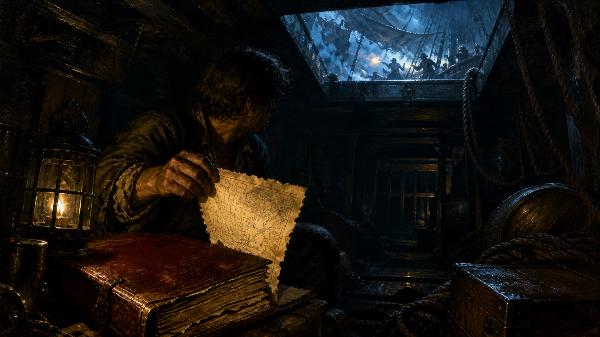

# 🖼️ 靴中殘頁：烏爾卡航線的私人槓桿

來源是《黑帆》（`series-black-sails`）S1E01 的觀影實錄。席爾瓦在甲板的砲火與艙門內外的屠戮之間，從紅皮航海日誌撕下烏爾卡號航線；所有人仍在找一本「不缺頁」的書，只有他知道缺口其實已經成為自己的籌碼。

畫面故意把殘頁置於前景，讓砲戰留在艙口外。暴力很響，但真正改變後續權力分配的不是砲火，而是誰先取得能重新估價未來的資料。資訊的價值不在紙張本身，而在其他人還以為它仍屬於共同帳本的那段時間。

這也是閱讀時最值得警惕的一格：看似完整的索引與冊子，不等於內容沒有被人抽走。當全船的搜尋目標是一份完整文件，缺頁者已經把「缺席」變成私人優勢。

