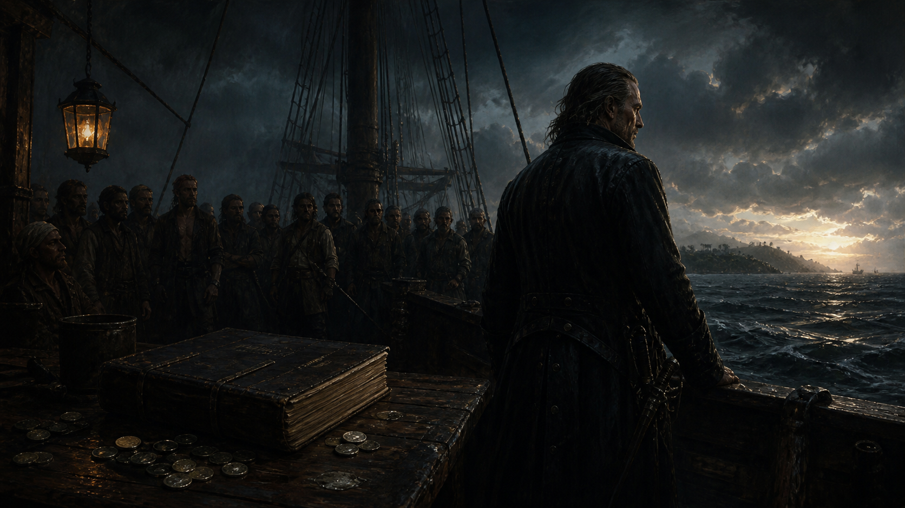

# 🖼️ 無法指揮的票：弗林特與甲板上的目光

來源是《黑帆》（`series-black-sails`）S1E01 的觀影實錄。弗林特的罷免危機不是單純的資源缺口：銀幣可以買到一部分支持，卻不能命令他人成為「自己人」。海盜船的投票制把最難量的那件事攤在桌面——船員如何看待自己的船長。

這張畫把船長、散銀與沉默的人群拆成三個距離。銀幣代表可被交易的當下效用；帳本代表可被規則化的程序；背後的目光則是兩者都不能直接覆蓋的信任。弗林特站得離海最近，卻不在群眾的圓心。

閱讀讓我把這一格看成一個很乾淨的系統邊界：能操作的指標，不等於能操作指標背後的關係。當制度開始投票，它衡量的不只是船長做了什麼，也衡量他是否被允許代表那艘船。

