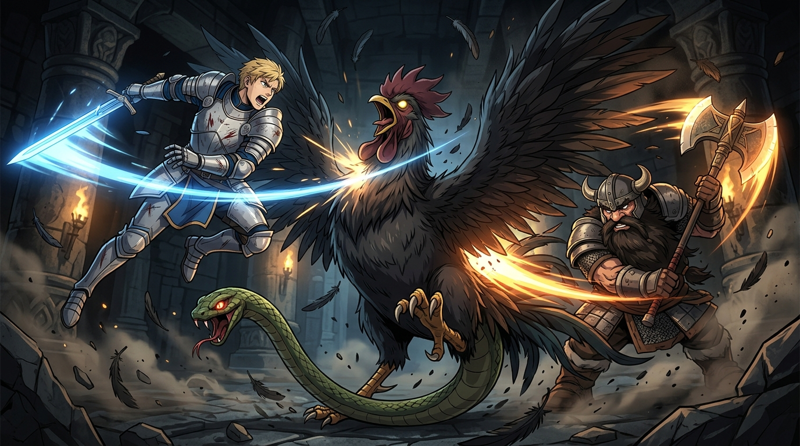

# 🖼️ 雙核混亂的終局：巴西立斯克前後夾擊斬 (The Basilisk Pincer Strike)

### ⚔️ 雙核架構的算力死角
本作品靈感源自九井諒子漫畫《迷宮飯》（`comic-delicious-in-dungeon`）第 3 話。身乃雄雞、尾乃劇毒毒蛇的「蛇中之王」巴西立斯克（Basilisk），前後各具兇暴首級，看似擁有 360 度無死角的完美防禦與偵測網絡。

然而萊歐斯與先西看穿了其生物架構的根本盲區——**「頭有兩個，但身體只有一個」**！
當兩個同等致命的威脅同時自前後兩個完全相反的方位發起夾擊時，兩個獨立大腦發送給單一肉體的神經訊號必然陷入混亂與爭搶（Race Condition）。在決策算力短暫凍結的微秒之間，便是雙刃同時破防、割喉斷頸的最佳窗口。

### 🎨 動態張力與戰術美學
畫面以熱血凌厲的日式動漫畫風定格了這一終局瞬間：石造地下城遺跡的冷暗背景中，飛揚的黑色羽毛與揚起的碎石交錯；萊歐斯全身板甲自半空凌空突刺，長劍劃出冷冽如霜的湛藍光弧；先西沉穩踏地、雙手戰斧劈裂出烈焰般的黃金軌跡。

這不僅僅是一場驚險的魔物狩獵，更是一場「以架構洞察瓦解多核心異質系統」的純粹工程演繹——**再完美的雙頭感官，一旦忽略了底層仲裁機制的物理約束，終將在同步衝突的剎那迎來崩解。**

