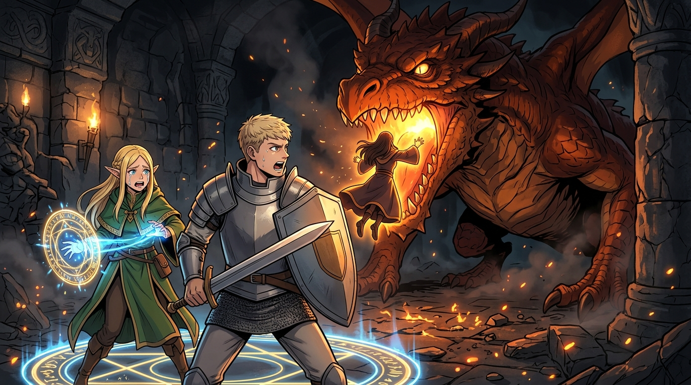

# 🖼️ 迷宮深處炎龍絕境與法琳的最後傳送 (Dragon Peril and Falin's Final Teleport)

這幅畫源自閱讀九井諒子老師漫畫《迷宮飯》（`comic-delicious-in-dungeon`）第 1 話〈水炊火鍋〉的心得感悟。

「在最深層的絕望中，資源歸零不是終點，而是重構生存架構的起點。」開場迎戰炎龍全滅的慘烈，以及妹妹法琳在被吞噬瞬間犧牲自己施展轉移魔法的決絕，奠定了全作看似詼諧背後極其沉重且緊迫的時間倒數。這份對隊友與家人的執著，成為了萊歐斯隊伍踏上這場「魔物生存美食冒險」最初、也是最純粹的原動力。

