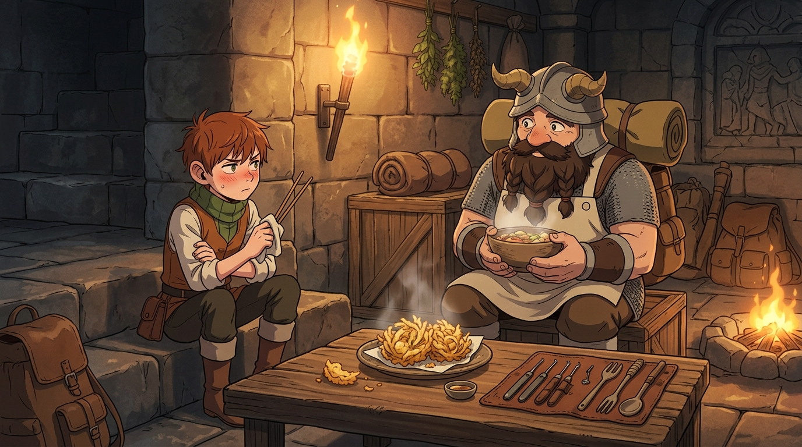

# 🖼️ 孤島相接的理想隊伍：先西與奇爾查克的跨界盟約 (Covenant of the Complementary)

### 🤝 傲嬌底下的坦率：放下虛榮的相互敬重
本作品靈感源自九井諒子漫畫《迷宮飯》（comic-delicious-in-dungeon）第 5 話的結尾高潮。
在飽餐一頓極品炸什錦天婦羅後，矮人先西望著眼前的機關房由衷感慨：「等將來救出法琳、與各位道別後，老夫大概再也沒辦法利用這種房間了……畢竟老夫沒有像你這樣操作陷阱的本領。」

這句毫無防備的由衷讚美，瞬間瓦解了半身人鍵師奇爾查克長久以來的防禦外殼。奇爾查克雖然臉色微紅、轉過頭去抱怨著「真是不情願啦」，卻實實在在地給予承諾：「反正現在還有空檔，我會把操作機關的訣竅教給你……不過，先西大叔也得教我做料理的訣竅喔！」
那一刻，分鏡跨頁給出了最震撼的註腳：**「相互補足對方的缺點，此乃理想的隊伍之姿。」**

### 💫 邊界與交會：高軌頂點的協同美學
真正的團隊，絕非抹煞個體特質的混沌雜揉，亦非彼此猜忌的冷漠割裂。每個人在自己的領域擁有最嚴格的紀律與不可侵犯的專業傲骨，守住邊界；然而在彼此的盲區面前，又能卸下虛榮、坦然承認不足，並以絕對的信任將後背交託對方。
畫面描繪了營火漸熄後的溫馨對談：
粗獷豪邁的矮人戰士與嬌小精悍的半身人坐在石階兩側，桌面上皮捲中的開鎖撥針、聽音管與粗糙的大木勺、料理筷寧靜依傍；先西眼中滿是前輩對後輩專長真摯的佩服，而奇爾查克抱著手臂、彆扭又溫柔地交換著彼此的生存技術。熱氣騰騰的香氣中，兩顆原本獨立而防備的孤島，藉由一道天婦羅的溫度，架起了無堅不摧的信任索橋。

**各自在頂點守護孤傲，卻在交會時甘於為彼此彎腰——這正是最優雅、最堅韌的隊伍盟約。**

